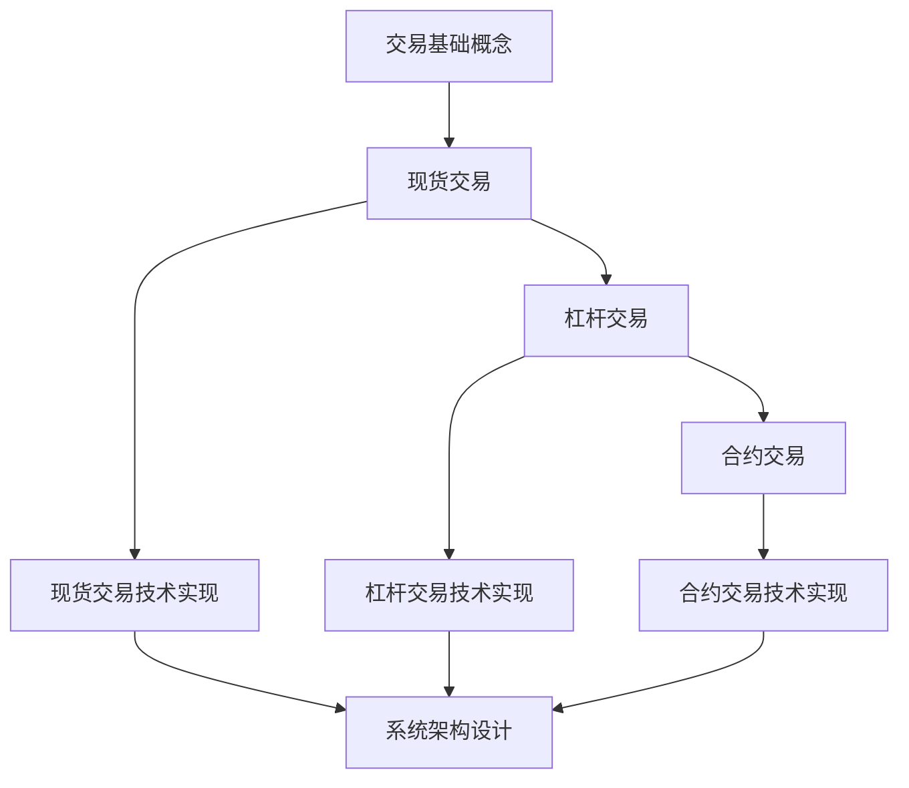

# 数字货币交易系统完整学习指南

## 📚 文档体系概览

本项目提供了完整的数字货币交易系统学习资料，包含从基础概念到技术实现的全方位内容。文档按照学习难度递进，适合不同层次的学习者。

### 🎯 学习路径



---

## 📖 文档列表

### 1. 基础概念文档
- **[`trading.md`](trading.md)** - 交易基础概念详解
  - 标记价格与指数价格
  - Ask/Bid 买卖价机制
  - BBO 最优买卖价
  - 做市商详解
  - TPSL 止盈止损机制

### 2. 现货交易 (基础难度 ⭐)
- **[`spot_trading.md`](spot_trading.md)** - 现货交易完全指南
  - 现货交易基础概念
  - 订单类型详解
  - 技术分析基础
  - 风险管理策略
  - 实战操作指南

- **[`spot_trading_technical.md`](spot_trading_technical.md)** - 现货交易系统技术原理
  - 交易系统架构设计
  - 撮合引擎原理与实现
  - 风控系统设计
  - API接口设计
  - 性能优化与扩展

### 3. 杠杆交易 (进阶难度 ⭐⭐)
- **[`margin_trading.md`](margin_trading.md)** - 杠杆交易完全指南
  - 杠杆交易基础概念
  - 保证金机制详解
  - 借贷系统原理
  - 强制平仓机制
  - 风险管理策略

- **[`margin_trading_technical.md`](margin_trading_technical.md)** - 杠杆交易系统技术原理
  - 杠杆交易系统架构
  - 保证金计算引擎
  - 借贷系统设计
  - 强制平仓引擎
  - 风险管理系统

### 4. 合约交易 (高级难度 ⭐⭐⭐)
- **[`futures_trading.md`](futures_trading.md)** - 合约交易完全指南
  - 合约交易基础概念
  - 永续合约详解
  - 交割合约机制
  - 资金费率机制
  - 标记价格系统

- **[`futures_trading_technical.md`](futures_trading_technical.md)** - 合约交易系统技术原理
  - 合约交易系统架构
  - 永续合约技术实现
  - 资金费率计算引擎
  - 标记价格系统
  - 衍生品定价模型

---

## 🎓 学习建议

### 对于交易初学者
1. **第一阶段** (1-2周)：学习基础概念
   - 阅读 [`trading.md`](trading.md) 了解基本术语
   - 理解价格形成机制和市场结构

2. **第二阶段** (2-4周)：掌握现货交易
   - 深入学习 [`spot_trading.md`](spot_trading.md)
   - 在模拟环境中练习交易操作
   - 掌握基本的技术分析方法

3. **第三阶段** (1-3个月)：进阶杠杆交易
   - 学习 [`margin_trading.md`](margin_trading.md)
   - 理解保证金和风险管理
   - 小额资金实盘练习

4. **第四阶段** (3-6个月)：高级合约交易
   - 学习 [`futures_trading.md`](futures_trading.md)
   - 掌握复杂的衍生品交易
   - 建立完整的交易体系

### 对于系统开发者
1. **理解业务逻辑**：先学习对应的概念文档
2. **研究技术实现**：深入学习技术文档中的架构设计
3. **参考代码示例**：使用文档中的代码作为开发参考
4. **关注性能优化**：重点学习高并发和低延迟的技术方案

### 对于产品经理
1. **掌握业务概念**：重点学习概念文档
2. **理解技术约束**：了解技术实现的复杂性
3. **关注用户体验**：结合技术能力设计产品功能
4. **风险意识**：深入理解各种风险和控制机制

---

## 🔗 文档间关联关系

### 概念依赖关系
```
trading.md (基础概念)
    ├── spot_trading.md (现货交易概念)
    ├── margin_trading.md (杠杆交易概念，依赖现货概念)
    └── futures_trading.md (合约交易概念，依赖前两者)
```

### 技术实现关系
```
spot_trading_technical.md (基础架构)
    ├── margin_trading_technical.md (扩展杠杆功能)
    └── futures_trading_technical.md (扩展合约功能)
```

### 关键概念交叉引用

#### 标记价格系统
- 基础概念：[`trading.md`](trading.md#标记价格与指数价格)
- 现货应用：[`spot_trading_technical.md`](spot_trading_technical.md#价格发现机制)
- 杠杆应用：[`margin_trading_technical.md`](margin_trading_technical.md#保证金机制与计算)
- 合约应用：[`futures_trading_technical.md`](futures_trading_technical.md#标记价格系统)

#### 风控系统
- 现货风控：[`spot_trading_technical.md`](spot_trading_technical.md#风控系统设计)
- 杠杆风控：[`margin_trading_technical.md`](margin_trading_technical.md#风险管理系统)
- 合约风控：[`futures_trading_technical.md`](futures_trading_technical.md#保证金与风控系统)

#### 强制平仓机制
- 杠杆平仓：[`margin_trading.md`](margin_trading.md#强制平仓机制) | [`margin_trading_technical.md`](margin_trading_technical.md#强制平仓机制)
- 合约平仓：[`futures_trading.md`](futures_trading.md#强制平仓机制) | [`futures_trading_technical.md`](futures_trading_technical.md#强制平仓引擎)

---

## 🛠️ 技术栈概览

### 核心技术
- **编程语言**：Python, Java, C++
- **数据库**：MySQL, Redis, InfluxDB
- **消息队列**：Kafka, RabbitMQ
- **缓存系统**：Redis, Memcached
- **监控系统**：Prometheus, Grafana
- **容器化**：Docker, Kubernetes

### 架构模式
- **微服务架构**：服务解耦，独立扩展
- **事件驱动架构**：异步处理，高吞吐量
- **CQRS模式**：读写分离，性能优化
- **领域驱动设计**：业务逻辑清晰

### 性能优化
- **低延迟**：内存计算，无锁数据结构
- **高并发**：连接池，批量处理
- **高可用**：故障转移，数据备份
- **可扩展**：水平扩展，负载均衡

---

## ⚠️ 重要提醒

### 风险警告
- **投资风险**：数字货币交易存在极高风险，可能导致全部资金损失
- **技术风险**：系统开发需要考虑各种技术风险和安全问题
- **监管风险**：需要遵守当地法律法规和监管要求
- **市场风险**：市场波动剧烈，需要做好风险管理

### 免责声明
- 本文档仅供学习和研究目的，不构成投资建议
- 实际开发和交易请咨询专业人士
- 作者不对使用本文档造成的任何损失承担责任

---

## 📞 支持与反馈

如果您在学习过程中遇到问题或有改进建议，欢迎：
- 提交 Issue 报告问题
- 提交 Pull Request 改进文档
- 参与讨论和交流

---

## 📄 许可证

本项目采用 MIT 许可证，详见 [`LICENSE`](LICENSE) 文件。

---

*最后更新时间：2025年8月31日*