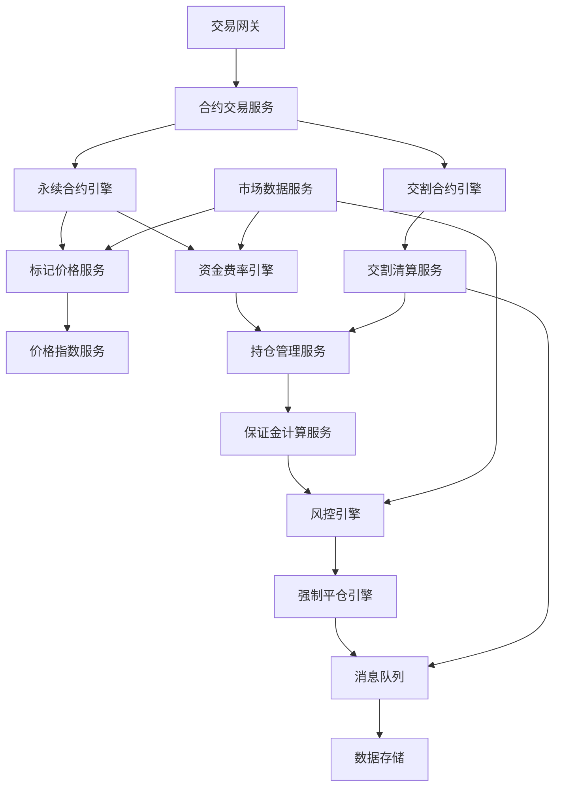

# 数字货币合约交易系统技术原理

## 目录
1. [合约交易系统架构](#合约交易系统架构)
2. [永续合约技术实现](#永续合约技术实现)
3. [交割合约系统设计](#交割合约系统设计)
4. [资金费率计算引擎](#资金费率计算引擎)
5. [标记价格系统](#标记价格系统)
6. [保证金与风控系统](#保证金与风控系统)
7. [强制平仓引擎](#强制平仓引擎)
8. [衍生品定价模型](#衍生品定价模型)
9. [高频交易优化](#高频交易优化)
10. [系统监控与运维](#系统监控与运维)

---

## 合约交易系统架构

### 1. 整体架构设计

#### 微服务架构图


#### 核心组件职责
```python
class FuturesTradeSystem:
    def __init__(self):
        self.perpetual_engine = PerpetualContractEngine()
        self.delivery_engine = DeliveryContractEngine()
        self.funding_rate_engine = FundingRateEngine()
        self.mark_price_service = MarkPriceService()
        self.margin_calculator = MarginCalculator()
        self.risk_engine = RiskEngine()
        self.liquidation_engine = LiquidationEngine()
        
    def process_contract_order(self, order):
        """处理合约订单"""
        # 1. 订单验证
        validation_result = self.validate_contract_order(order)
        if not validation_result.valid:
            return OrderResult.REJECTED(validation_result.reason)
        
        # 2. 保证金检查
        margin_check = self.margin_calculator.check_margin_requirement(order)
        if not margin_check.sufficient:
            return OrderResult.REJECTED("保证金不足")
        
        # 3. 风险检查
        risk_check = self.risk_engine.assess_order_risk(order)
        if risk_check.risk_level > RiskLevel.ACCEPTABLE:
            return OrderResult.REJECTED("风险过高")
        
        # 4. 路由到相应引擎
        if order.contract_type == ContractType.PERPETUAL:
            return self.perpetual_engine.process_order(order)
        else:
            return self.delivery_engine.process_order(order)
```

### 2. 数据模型设计

#### 合约定义
```python
class Contract:
    def __init__(self, symbol, contract_type, base_currency, quote_currency):
        self.symbol = symbol                    # 合约标识 (如 BTCUSDT)
        self.contract_type = contract_type      # 合约类型 (永续/交割)
        self.base_currency = base_currency      # 基础货币
        self.quote_currency = quote_currency    # 报价货币
        self.contract_size = Decimal('1')       # 合约大小
        self.tick_size = Decimal('0.1')         # 最小价格变动
        self.min_qty = Decimal('0.001')         # 最小数量
        self.max_leverage = 125                 # 最大杠杆
        self.maintenance_margin_rate = {}       # 维持保证金率
        self.maker_fee_rate = Decimal('0.0002') # 挂单手续费率
        self.taker_fee_rate = Decimal('0.0004') # 吃单手续费率

class PerpetualContract(Contract):
    def __init__(self, *args, **kwargs):
        super().__init__(*args, **kwargs)
        self.funding_interval = 28800           # 资金费率间隔 (8小时)
        self.funding_rate_cap = Decimal('0.0075')  # 资金费率上限
        self.funding_rate_floor = Decimal('-0.0075') # 资金费率下限

class DeliveryContract(Contract):
    def __init__(self, *args, delivery_time=None, **kwargs):
        super().__init__(*args, **kwargs)
        self.delivery_time = delivery_time      # 交割时间
        self.settlement_price = None            # 结算价格
        self.is_settled = False                 # 是否已结算
```

#### 持仓模型
```python
class Position:
    def __init__(self, user_id, symbol, contract_type):
        self.user_id = user_id
        self.symbol = symbol
        self.contract_type = contract_type
        self.side = PositionSide.NONE           # 持仓方向
        self.size = Decimal('0')                # 持仓数量
        self.entry_price = Decimal('0')         # 开仓均价
        self.mark_price = Decimal('0')          # 标记价格
        self.unrealized_pnl = Decimal('0')      # 未实现盈亏
        self.realized_pnl = Decimal('0')        # 已实现盈亏
        self.margin = Decimal('0')              # 占用保证金
        self.leverage = 1                       # 杠杆倍数
        self.last_funding_time = 0              # 上次资金费率时间
        
    def update_unrealized_pnl(self, mark_price):
        """更新未实现盈亏"""
        if self.size == 0:
            self.unrealized_pnl = Decimal('0')
            return
        
        if self.side == PositionSide.LONG:
            self.unrealized_pnl = (mark_price - self.entry_price) * self.size
        else:
            self.unrealized_pnl = (self.entry_price - mark_price) * self.size
        
        self.mark_price = mark_price
    
    def calculate_margin_requirement(self, maintenance_margin_rate):
        """计算保证金要求"""
        if self.size == 0:
            return Decimal('0')
        
        position_value = abs(self.size) * self.mark_price
        return position_value * maintenance_margin_rate
```

---

## 永续合约技术实现

### 1. 永续合约引擎

#### 核心交易逻辑
```python
class PerpetualContractEngine:
    def __init__(self):
        self.order_book = OrderBook()
        self.position_manager = PositionManager()
        self.funding_rate_calculator = FundingRateCalculator()
        
    def process_order(self, order):
        """处理永续合约订单"""
        try:
            # 1. 更新持仓
            position_update = self.update_position(order)
            
            # 2. 计算保证金变化
            margin_change = self.calculate_margin_change(order, position_update)
            
            # 3. 执行交易
            trade_result = self.execute_trade(order)
            
            # 4. 更新账户
            account_update = self.update_account(
                order.user_id, margin_change, trade_result
            )
            
            return OrderResult.SUCCESS(trade_result, account_update)
            
        except Exception as e:
            return OrderResult.FAILED(str(e))
    
    def update_position(self, order):
        """更新持仓"""
        position = self.position_manager.get_position(
            order.user_id, order.symbol
        )
        
        if position.size == 0:
            # 开新仓
            position.side = PositionSide.LONG if order.side == 'BUY' else PositionSide.SHORT
            position.size = order.quantity
            position.entry_price = order.price
            position.leverage = order.leverage
        else:
            # 调整现有仓位
            if self.is_same_direction(position.side, order.side):
                # 加仓
                total_value = position.size * position.entry_price + order.quantity * order.price
                total_size = position.size + order.quantity
                position.entry_price = total_value / total_size
                position.size = total_size
            else:
                # 减仓或反向开仓
                if order.quantity >= position.size:
                    # 平仓并反向开仓
                    remaining_qty = order.quantity - position.size
                    realized_pnl = self.calculate_realized_pnl(position, order.price)
                    
                    position.realized_pnl += realized_pnl
                    position.size = remaining_qty
                    position.entry_price = order.price if remaining_qty > 0 else Decimal('0')
                    position.side = self.get_opposite_side(position.side) if remaining_qty > 0 else PositionSide.NONE
                else:
                    # 部分平仓
                    close_ratio = order.quantity / position.size
                    realized_pnl = self.calculate_realized_pnl(position, order.price) * close_ratio
                    
                    position.realized_pnl += realized_pnl
                    position.size -= order.quantity
        
        return position
```

#### 资金费率处理
```python
class FundingRateProcessor:
    def __init__(self):
        self.funding_interval = 28800  # 8小时
        self.last_funding_time = {}
        
    def process_funding_payment(self, symbol):
        """处理资金费率支付"""
        current_time = time.time()
        last_time = self.last_funding_time.get(symbol, 0)
        
        if current_time - last_time < self.funding_interval:
            return  # 未到支付时间
        
        # 计算当前资金费率
        funding_rate = self.calculate_current_funding_rate(symbol)
        
        # 获取所有持仓
        positions = self.get_all_positions(symbol)
        
        funding_payments = []
        
        for position in positions:
            if position.size == 0:
                continue
            
            # 计算资金费用
            position_value = abs(position.size) * position.mark_price
            funding_amount = position_value * funding_rate
            
            if position.side == PositionSide.LONG:
                # 多头支付资金费用 (如果费率为正)
                payment = -funding_amount if funding_rate > 0 else -funding_amount
            else:
                # 空头收取资金费用 (如果费率为正)
                payment = funding_amount if funding_rate > 0 else funding_amount
            
            funding_payments.append(FundingPayment(
                user_id=position.user_id,
                symbol=symbol,
                position_size=position.size,
                funding_rate=funding_rate,
                payment_amount=payment,
                timestamp=current_time
            ))
        
        # 批量处理资金费率支付
        self.execute_funding_payments(funding_payments)
        self.last_funding_time[symbol] = current_time
    
    def calculate_current_funding_rate(self, symbol):
        """计算当前资金费率"""
        # 获取溢价指数
        premium_index = self.calculate_premium_index(symbol)
        
        # 获取利率组件
        interest_rate_component = self.calculate_interest_rate_component()
        
        # 计算资金费率
        funding_rate = premium_index + interest_rate_component
        
        # 应用上下限
        contract = self.get_contract(symbol)
        funding_rate = max(contract.funding_rate_floor, 
                          min(contract.funding_rate_cap, funding_rate))
        
        return funding_rate
    
    def calculate_premium_index(self, symbol, time_window=480):
        """计算溢价指数 (8分钟窗口)"""
        current_time = time.time()
        start_time = current_time - time_window
        
        # 获取时间窗口内的价格数据
        contract_prices = self.get_contract_prices(symbol, start_time, current_time)
        mark_prices = self.get_mark_prices(symbol, start_time, current_time)
        
        if not contract_prices or not mark_prices:
            return Decimal('0')
        
        # 计算每分钟的溢价率
        premium_rates = []
        for i in range(len(contract_prices)):
            if mark_prices[i] > 0:
                premium_rate = (contract_prices[i] - mark_prices[i]) / mark_prices[i]
                premium_rates.append(premium_rate)
        
        if not premium_rates:
            return Decimal('0')
        
        # 计算溢价指数 (时间加权平均)
        premium_index = sum(premium_rates) / len(premium_rates)
        
        # 应用阻尼系数
        damping_factor = Decimal('0.05')  # 5%的阻尼
        premium_index = max(-damping_factor, min(damping_factor, premium_index))
        
        return premium_index
```

### 2. 永续合约风控

#### 动态保证金计算
```python
class PerpetualMarginCalculator:
    def __init__(self):
        self.base_margin_rates = self.load_base_margin_rates()
        self.volatility_adjustments = {}
        
    def calculate_initial_margin(self, symbol, size, price, leverage):
        """计算初始保证金"""
        position_value = abs(size) * price
        base_margin_rate = Decimal('1') / leverage
        
        # 获取风险调整因子
        risk_adjustment = self.get_risk_adjustment_factor(symbol, position_value)
        
        # 计算调整后的保证金率
        adjusted_margin_rate = base_margin_rate * (Decimal('1') + risk_adjustment)
        
        initial_margin = position_value * adjusted_margin_rate
        
        return initial_margin
    
    def calculate_maintenance_margin(self, position):
        """计算维持保证金"""
        if position.size == 0:
            return Decimal('0')
        
        position_value = abs(position.size) * position.mark_price
        
        # 基础维持保证金率 (根据杠杆倍数)
        base_rate = self.get_maintenance_margin_rate(position.leverage)
        
        # 波动率调整
        volatility_adjustment = self.get_volatility_adjustment(position.symbol)
        
        # 持仓规模调整
        size_adjustment = self.get_size_adjustment(position_value)
        
        # 综合保证金率
        total_rate = base_rate + volatility_adjustment + size_adjustment
        
        maintenance_margin = position_value * total_rate
        
        return maintenance_margin
    
    def get_maintenance_margin_rate(self, leverage):
        """根据杠杆倍数获取维持保证金率"""
        if leverage <= 5:
            return Decimal('0.005')    # 0.5%
        elif leverage <= 10:
            return Decimal('0.01')     # 1.0%
        elif leverage <= 20:
            return Decimal('0.025')    # 2.5%
        elif leverage <= 50:
            return Decimal('0.05')     # 5.0%
        elif leverage <= 100:
            return Decimal('0.1')      # 10.0%
        else:
            return Decimal('0.125')    # 12.5%
    
    def get_volatility_adjustment(self, symbol, lookback_hours=24):
        """获取波动率调整因子"""
        if symbol in self.volatility_adjustments:
            cached_adjustment = self.volatility_adjustments[symbol]
            if time.time() - cached_adjustment['timestamp'] < 3600:  # 1小时缓存
                return cached_adjustment['value']
        
        # 计算历史波动率
        historical_prices = self.get_historical_prices(symbol, lookback_hours)
        if len(historical_prices) < 2:
            return Decimal('0')
        
        returns = []
        for i in range(1, len(historical_prices)):
            ret = (historical_prices[i] - historical_prices[i-1]) / historical_prices[i-1]
            returns.append(float(ret))
        
        volatility = np.std(returns) * np.sqrt(24)  # 日化波动率
        
        # 波动率分级调整
        if volatility < 0.02:
            adjustment = Decimal('0')
        elif volatility < 0.05:
            adjustment = Decimal('0.001')
        elif volatility < 0.1:
            adjustment = Decimal('0.002')
        else:
            adjustment = Decimal('0.005')
        
        # 缓存结果
        self.volatility_adjustments[symbol] = {
            'value': adjustment,
            'timestamp': time.time()
        }
        
        return adjustment
```

---

## 交割合约系统设计

### 1. 交割合约引擎

#### 交割合约管理
```python
class DeliveryContractEngine:
    def __init__(self):
        self.active_contracts = {}  # 活跃合约
        self.settlement_engine = SettlementEngine()
        self.delivery_scheduler = DeliveryScheduler()
        
    def create_delivery_contract(self, base_symbol, delivery_date):
        """创建交割合约"""
        contract_symbol = f"{base_symbol}_{delivery_date.strftime('%y%m%d')}"
        
        contract = DeliveryContract(
            symbol=contract_symbol,
            base_symbol=base_symbol,
            delivery_time=delivery_date,
            contract_type=ContractType.DELIVERY
        )
        
        self.active_contracts[contract_symbol] = contract
        
        # 注册交割任务
        self.delivery_scheduler.schedule_delivery(contract)
        
        return contract
    
    def process_delivery_order(self, order):
        """处理交割合约订单"""
        contract = self.active_contracts.get(order.symbol)
        if not contract:
            return OrderResult.REJECTED("合约不存在")
        
        # 检查是否临近交割
        time_to_delivery = contract.delivery_time - time.time()
        if time_to_delivery < 1800:  # 30分钟内不允许开仓
            if self.is_opening_order(order):
                return OrderResult.REJECTED("临近交割，不允许开仓")
        
        # 处理订单
        return self.execute_delivery_order(order, contract)
    
    def execute_delivery_order(self, order, contract):
        """执行交割合约订单"""
        # 更新持仓
        position = self.update_delivery_position(order, contract)
        
        # 计算保证金
        margin_requirement = self.calculate_delivery_margin(position, contract)
        
        # 执行交易
        trade_result = self.execute_trade(order)
        
        return OrderResult.SUCCESS(trade_result)

class DeliveryScheduler:
    def __init__(self):
        self.scheduled_deliveries = {}
        self.settlement_engine = SettlementEngine()
        
    def schedule_delivery(self, contract):
        """安排交割任务"""
        delivery_time = contract.delivery_time
        
        # 安排交割前通知 (24小时前)
        notification_time = delivery_time - 86400
        self.schedule_task(notification_time, self.send_delivery_notification, contract)
        
        # 安排停止开仓 (30分钟前)
        stop_opening_time = delivery_time - 1800
        self.schedule_task(stop_opening_time, self.stop_new_positions, contract)
        
        # 安排交割执行
        self.schedule_task(delivery_time, self.execute_delivery, contract)
    
    def execute_delivery(self, contract):
        """执行交割"""
        try:
            # 1. 计算交割价格
            settlement_price = self.calculate_settlement_price(contract)
            contract.settlement_price = settlement_price
            
            # 2. 获取所有持仓
            positions = self.get_all_positions(contract.symbol)
            
            # 3. 批量结算
            settlement_results = []
            for position in positions:
                if position.size != 0:
                    result = self.settle_position(position, settlement_price)
                    settlement_results.append(result)
            
            # 4. 更新合约状态
            contract.is_settled = True
            
            # 5. 记录交割结果
            self.record_delivery_result(contract, settlement_results)
            
            return DeliveryResult.SUCCESS(settlement_results)
            
        except Exception as e:
            return DeliveryResult.FAILED(str(e))
    
    def calculate_settlement_price(self, contract):
        """计算交割价格"""
        # 交割前1小时的现货价格平均值
        end_time = contract.delivery_time
        start_time = end_time - 3600  # 1小时
        
        spot_prices = self.get_spot_prices(
            contract.base_symbol, start_time, end_time
        )
        
        if not spot_prices:
            raise Exception("无法获取现货价格数据")
        
        # 计算算术平均值
        settlement_price = sum(spot_prices) / len(spot_prices)
        
        return settlement_price
    
    def settle_position(self, position, settlement_price):
        """结算单个持仓"""
        if position.size == 0:
            return SettlementResult.NO_POSITION()
        
        # 计算盈亏
        if position.side == PositionSide.LONG:
            pnl = (settlement_price - position.entry_price) * position.size
        else:
            pnl = (position.entry_price - settlement_price) * position.size
        
        # 释放保证金
        released_margin = position.margin
        
        # 更新账户
        account_update = AccountUpdate(
            user_id=position.user_id,
            balance_change=pnl + released_margin,
            realized_pnl=pnl,
            released_margin=released_margin
        )
        
        # 清空持仓
        position.size = Decimal('0')
        position.margin = Decimal('0')
        position.unrealized_pnl = Decimal('0')
        
        return SettlementResult.SUCCESS(account_update)
```

### 2. 交割价格计算

#### 价格聚合算法
```python
class SettlementPriceCalculator:
    def __init__(self):
        self.price_sources = self.load_price_sources()
        self.outlier_threshold = 0.05  # 5%异常值阈值
        
    def calculate_settlement_price(self, symbol, start_time, end_time):
        """计算结算价格"""
        # 1. 收集价格数据
        price_data = self.collect_price_data(symbol, start_time, end_time)
        
        # 2. 数据清洗
        cleaned_data = self.clean_price_data(price_data)
        
        # 3. 计算加权平均价格
        settlement_price = self.calculate_weighted_average(cleaned_data)
        
        return settlement_price
    
    def collect_price_data(self, symbol, start_time, end_time):
        """收集价格数据"""
        all_prices = []
        
        for source, config in self.price_sources.items():
            try:
                prices = self.get_prices_from_source(
                    source, symbol, start_time, end_time
                )
                
                for price_point in prices:
                    all_prices.append({
                        'timestamp': price_point['timestamp'],
                        'price': price_point['price'],
                        'source': source,
                        'weight': config['weight'],
                        'volume': price_point.get('volume', 0)
                    })
                    
            except Exception as e:
                self.log_error(f"获取{source}价格数据失败: {e}")
                continue
        
        # 按时间排序
        all_prices.sort(key=lambda x: x['timestamp'])
        
        return all_prices
    
    def clean_price_data(self, price_data):
        """清洗价格数据"""
        if not price_data:
            return []
        
        cleaned_data = []
        
        # 按时间窗口分组 (每分钟)
        time_windows = self.group_by_time_window(price_data, window_size=60)
        
        for window_data in time_windows:
            if len(window_data) < 2:
                cleaned_data.extend(window_data)
                continue
            
            # 计算中位数价格
            prices = [d['price'] for d in window_data]
            median_price = np.median(prices)
            
            # 过滤异常值
            filtered_data = []
            for data_point in window_data:
                deviation = abs(data_point['price'] - median_price) / median_price
                if deviation <= self.outlier_threshold:
                    filtered_data.append(data_point)
            
            cleaned_data.extend(filtered_data)
        
        return cleaned_data
    
    def calculate_weighted_average(self, price_data):
        """计算加权平均价格"""
        if not price_data:
            raise Exception("没有有效的价格数据")
        
        total_weighted_price = Decimal('0')
        total_weight = Decimal('0')
        
        for data_point in price_data:
            price = Decimal(str(data_point['price']))
            weight = Decimal(str(data_point['weight']))
            volume = Decimal(str(data_point.get('volume', 1)))
            
            # 综合权重 = 配置权重 × 成交量权重
            combined_weight = weight * volume
            
            total_weighted_price += price * combined_weight
            total_weight += combined_weight
        
        if total_weight == 0:
            raise Exception("总权重为零")
        
        weighted_average = total_weighted_price / total_weight
        
        return weighted_average
```

---

## 资金费率计算引擎

### 1. 资金费率计算核心

#### 实时费率计算
```python
class FundingRateEngine:
    def __init__(self):
        self.base_rate = Decimal('0.0001')  # 基础利率 0.01%
        self.premium_components = {}
        self.funding_history = {}
        
    def calculate_funding_rate(self, symbol):
        """计算资金费率"""
        # 1. 计算溢价组件
        premium_component = self.calculate_premium_component(symbol)
        
        # 2. 计算利率组件
        interest_component = self.calculate_interest_component()
        
        # 3. 综合计算
        funding_rate = premium_component + interest_component
        
        # 4. 应用限制
        funding_rate = self.apply_funding_rate_limits(symbol, funding_rate)
        
        # 5. 平滑处理
        smoothed_rate = self.smooth_funding_rate(symbol, funding_rate)
        
        return smoothed_rate
    
    def calculate_premium_component(self, symbol, time_window=480):
        """计算溢价组件 (8分钟窗口)"""
        current_time = time.time()
        start_time = current_time - time_window
        
        # 获取合约价格和标记价格
        contract_prices = self.get_contract_prices(symbol, start_time, current_time)
        mark_prices = self.get_mark_prices(symbol, start_time, current_time)
        
        if not contract_prices or not mark_prices:
            return Decimal('0')
        
        # 计算每个时间点的溢价率
        premium_rates = []
        for i in range(min(len(contract_prices), len(mark_prices))):
            if mark_prices[i] > 0:
                premium = (contract_prices[i] - mark_prices[i]) / mark_prices[i]
                premium_rates.append(premium)
        
        if not premium_rates:
            return Decimal('0')
        
        # 计算时间加权平均溢价率
        avg_premium = sum(premium_rates) / len(premium_rates)
        
        # 应用阻尼因子
        damping_factor = Decimal('0.05')  # 5%
        clamped_premium = max(-damping_factor, min(damping_factor, avg_premium))
        
        return clamped_premium
    
    def calculate_interest_component(self):
        """计算利率组件"""
        # 简化实现：使用固定基础利率
        # 实际实现中可能需要考虑：
        # - 不同货币的利率差
        # - 市场流动性状况
        # - 借贷成本
        return self.base_rate
    
    def apply_funding_rate_limits(self, symbol, funding_rate):
        """应用资金费率限制"""
        contract = self.get_contract(symbol)
        
        # 应用上下限
        limited_rate = max(
            contract.funding_rate_floor,
            min(contract.funding_rate_cap, funding_rate)
        )
        

        return limited_rate
    
    def smooth_funding_rate(self, symbol, new_rate):
        """平滑资金费率"""
        if symbol not in self.funding_history:
            self.funding_history[symbol] = []
        
        history = self.funding_history[symbol]
        history.append({
            'rate': new_rate,
            'timestamp': time.time()
        })
        
        # 保留最近10个费率记录
        if len(history) > 10:
            history.pop(0)
        
        # 计算指数移动平均
        if len(history) == 1:
            return new_rate
        
        alpha = Decimal('0.3')  # 平滑因子
        prev_rate = history[-2]['rate']
        smoothed_rate = alpha * new_rate + (1 - alpha) * prev_rate
        
        return smoothed_rate

class FundingRateDistributor:
    def __init__(self):
        self.payment_processor = PaymentProcessor()
        
    def distribute_funding_payments(self, symbol, funding_rate):
        """分发资金费率支付"""
        positions = self.get_all_positions(symbol)
        
        long_positions = []
        short_positions = []
        
        for position in positions:
            if position.size == 0:
                continue
                
            if position.side == PositionSide.LONG:
                long_positions.append(position)
            else:
                short_positions.append(position)
        
        # 计算支付金额
        payments = self.calculate_funding_payments(
            long_positions, short_positions, funding_rate
        )
        
        # 执行支付
        self.execute_funding_payments(payments)
        
        return payments
    
    def calculate_funding_payments(self, long_positions, short_positions, funding_rate):
        """计算资金费率支付"""
        payments = []
        
        total_long_value = Decimal('0')
        total_short_value = Decimal('0')
        
        # 计算总持仓价值
        for position in long_positions:
            position_value = abs(position.size) * position.mark_price
            total_long_value += position_value
        
        for position in short_positions:
            position_value = abs(position.size) * position.mark_price
            total_short_value += position_value
        
        # 计算每个持仓的支付金额
        for position in long_positions:
            position_value = abs(position.size) * position.mark_price
            payment_amount = position_value * funding_rate
            
            payments.append(FundingPayment(
                user_id=position.user_id,
                symbol=position.symbol,
                position_side=position.side,
                position_value=position_value,
                funding_rate=funding_rate,
                payment_amount=-payment_amount if funding_rate > 0 else -payment_amount
            ))
        
        for position in short_positions:
            position_value = abs(position.size) * position.mark_price
            payment_amount = position_value * funding_rate
            
            payments.append(FundingPayment(
                user_id=position.user_id,
                symbol=position.symbol,
                position_side=position.side,
                position_value=position_value,
                funding_rate=funding_rate,
                payment_amount=payment_amount if funding_rate > 0 else payment_amount
            ))
        
        return payments
```

---

## 标记价格系统

### 1. 标记价格计算引擎

#### 多源价格聚合
```python
class MarkPriceService:
    def __init__(self):
        self.price_sources = self.load_price_sources()
        self.index_calculator = IndexPriceCalculator()
        self.mark_price_cache = {}
        
    def calculate_mark_price(self, symbol):
        """计算标记价格"""
        try:
            # 1. 计算指数价格
            index_price = self.index_calculator.calculate_index_price(symbol)
            if not index_price:
                return self.get_fallback_mark_price(symbol)
            
            # 2. 计算基差移动平均
            basis_ma = self.calculate_basis_moving_average(symbol)
            
            # 3. 计算标记价格
            mark_price = index_price + basis_ma
            
            # 4. 应用价格限制
            mark_price = self.apply_price_limits(symbol, mark_price, index_price)
            
            # 5. 缓存结果
            self.cache_mark_price(symbol, mark_price)
            
            return mark_price
            
        except Exception as e:
            self.log_error(f"计算标记价格失败 {symbol}: {e}")
            return self.get_fallback_mark_price(symbol)
    
    def calculate_basis_moving_average(self, symbol, window_minutes=5):
        """计算基差移动平均"""
        current_time = time.time()
        start_time = current_time - window_minutes * 60
        
        # 获取历史基差数据
        basis_history = self.get_basis_history(symbol, start_time, current_time)
        
        if not basis_history:
            return Decimal('0')
        
        # 计算时间加权移动平均
        total_weighted_basis = Decimal('0')
        total_weight = Decimal('0')
        
        for basis_point in basis_history:
            # 时间权重：越近的数据权重越大
            time_diff = current_time - basis_point['timestamp']
            weight = Decimal(str(math.exp(-time_diff / 300)))  # 5分钟衰减
            
            total_weighted_basis += basis_point['basis'] * weight
            total_weight += weight
        
        if total_weight == 0:
            return Decimal('0')
        
        basis_ma = total_weighted_basis / total_weight
        
        return basis_ma
    
    def apply_price_limits(self, symbol, mark_price, index_price):
        """应用价格限制"""
        # 标记价格不能偏离指数价格太远
        max_deviation = Decimal('0.05')  # 5%
        
        max_mark_price = index_price * (Decimal('1') + max_deviation)
        min_mark_price = index_price * (Decimal('1') - max_deviation)
        
        limited_mark_price = max(min_mark_price, min(max_mark_price, mark_price))
        
        return limited_mark_price

class IndexPriceCalculator:
    def __init__(self):
        self.exchanges = self.load_exchange_config()
        self.price_cache = {}
        self.cache_ttl = 5  # 5秒缓存
        
    def calculate_index_price(self, symbol):
        """计算指数价格"""
        cache_key = f"index_price_{symbol}"
        cached_result = self.price_cache.get(cache_key)
        
        if cached_result and time.time() - cached_result['timestamp'] < self.cache_ttl:
            return cached_result['price']
        
        # 收集各交易所价格
        exchange_prices = []
        
        for exchange, config in self.exchanges.items():
            try:
                price_data = self.get_exchange_price(exchange, symbol)
                if price_data and self.is_price_valid(price_data, symbol):
                    exchange_prices.append({
                        'exchange': exchange,
                        'price': price_data['price'],
                        'volume': price_data.get('volume', 0),
                        'weight': config['weight']
                    })
            except Exception as e:
                self.log_warning(f"获取{exchange}价格失败: {e}")
                continue
        
        if not exchange_prices:
            return None
        
        # 计算加权平均价格
        index_price = self.calculate_weighted_average_price(exchange_prices)
        
        # 缓存结果
        self.price_cache[cache_key] = {
            'price': index_price,
            'timestamp': time.time()
        }
        
        return index_price
    
    def calculate_weighted_average_price(self, exchange_prices):
        """计算加权平均价格"""
        total_weighted_price = Decimal('0')
        total_weight = Decimal('0')
        
        for price_data in exchange_prices:
            price = Decimal(str(price_data['price']))
            volume = Decimal(str(price_data['volume']))
            config_weight = Decimal(str(price_data['weight']))
            
            # 综合权重 = 配置权重 × 成交量权重
            volume_weight = min(Decimal('2'), volume / Decimal('1000'))  # 成交量权重上限2倍
            combined_weight = config_weight * (Decimal('1') + volume_weight)
            
            total_weighted_price += price * combined_weight
            total_weight += combined_weight
        
        if total_weight == 0:
            return None
        
        weighted_average = total_weighted_price / total_weight
        
        return weighted_average
    
    def is_price_valid(self, price_data, symbol, max_deviation=0.1):
        """验证价格有效性"""
        price = price_data['price']
        
        # 获取最近的指数价格作为参考
        recent_index = self.get_recent_index_price(symbol)
        if not recent_index:
            return True  # 没有参考价格，认为有效
        
        # 检查价格偏差
        deviation = abs(price - recent_index) / recent_index
        if deviation > max_deviation:
            return False
        
        # 检查价格合理性
        if price <= 0:
            return False
        
        # 检查成交量
        volume = price_data.get('volume', 0)
        if volume < 0:
            return False
        
        return True
```

### 2. 价格异常检测

#### 实时异常监控
```python
class PriceAnomalyDetector:
    def __init__(self):
        self.price_history = {}
        self.anomaly_thresholds = {
            'price_jump': 0.05,      # 5%价格跳跃
            'volume_spike': 3.0,     # 3倍成交量激增
            'spread_widening': 0.02  # 2%价差扩大
        }
        
    def detect_price_anomalies(self, symbol, current_price, current_volume):
        """检测价格异常"""
        anomalies = []
        
        # 获取历史数据
        history = self.price_history.get(symbol, [])
        
        if len(history) < 10:  # 需要足够的历史数据
            self.update_price_history(symbol, current_price, current_volume)
            return anomalies
        
        # 检测价格跳跃
        price_jump_anomaly = self.detect_price_jump(history, current_price)
        if price_jump_anomaly:
            anomalies.append(price_jump_anomaly)
        
        # 检测成交量异常
        volume_anomaly = self.detect_volume_anomaly(history, current_volume)
        if volume_anomaly:
            anomalies.append(volume_anomaly)
        
        # 检测价差异常
        spread_anomaly = self.detect_spread_anomaly(symbol, current_price)
        if spread_anomaly:
            anomalies.append(spread_anomaly)
        
        # 更新历史数据
        self.update_price_history(symbol, current_price, current_volume)
        
        return anomalies
    
    def detect_price_jump(self, history, current_price):
        """检测价格跳跃"""
        if not history:
            return None
        
        recent_prices = [h['price'] for h in history[-5:]]  # 最近5个价格
        avg_recent_price = sum(recent_prices) / len(recent_prices)
        
        price_change = abs(current_price - avg_recent_price) / avg_recent_price
        
        if price_change > self.anomaly_thresholds['price_jump']:
            return PriceAnomaly(
                type='PRICE_JUMP',
                severity='HIGH' if price_change > 0.1 else 'MEDIUM',
                description=f'价格跳跃 {price_change:.2%}',
                current_value=current_price,
                reference_value=avg_recent_price
            )
        
        return None
    
    def detect_volume_anomaly(self, history, current_volume):
        """检测成交量异常"""
        if not history or current_volume <= 0:
            return None
        
        recent_volumes = [h['volume'] for h in history[-10:] if h['volume'] > 0]
        if not recent_volumes:
            return None
        
        avg_volume = sum(recent_volumes) / len(recent_volumes)
        
        if avg_volume > 0:
            volume_ratio = current_volume / avg_volume
            
            if volume_ratio > self.anomaly_thresholds['volume_spike']:
                return PriceAnomaly(
                    type='VOLUME_SPIKE',
                    severity='HIGH' if volume_ratio > 5.0 else 'MEDIUM',
                    description=f'成交量激增 {volume_ratio:.1f}倍',
                    current_value=current_volume,
                    reference_value=avg_volume
                )
        
        return None
    
    def handle_price_anomaly(self, symbol, anomaly):
        """处理价格异常"""
        if anomaly.severity == 'HIGH':
            # 高严重性异常：暂停标记价格更新
            self.pause_mark_price_update(symbol, duration=300)  # 5分钟
            
            # 发送紧急告警
            self.send_emergency_alert(symbol, anomaly)
            
        elif anomaly.severity == 'MEDIUM':
            # 中等严重性异常：增加价格平滑
            self.increase_price_smoothing(symbol, factor=2.0)
            
            # 发送警告
            self.send_warning_alert(symbol, anomaly)
        
        # 记录异常事件
        self.log_anomaly_event(symbol, anomaly)
```

---

## 保证金与风控系统

### 1. 动态保证金计算

#### 实时保证金监控
```python
class FuturesMarginManager:
    def __init__(self):
        self.margin_calculator = FuturesMarginCalculator()
        self.risk_assessor = RiskAssessor()
        self.position_manager = PositionManager()
        
    def calculate_account_margin(self, user_id):
        """计算账户保证金状况"""
        positions = self.position_manager.get_user_positions(user_id)
        
        total_initial_margin = Decimal('0')
        total_maintenance_margin = Decimal('0')
        total_unrealized_pnl = Decimal('0')
        
        for position in positions:
            if position.size == 0:
                continue
            
            # 更新标记价格和未实现盈亏
            mark_price = self.get_current_mark_price(position.symbol)
            position.update_unrealized_pnl(mark_price)
            
            # 计算保证金要求
            initial_margin = self.margin_calculator.calculate_initial_margin(position)
            maintenance_margin = self.margin_calculator.calculate_maintenance_margin(position)
            
            total_initial_margin += initial_margin
            total_maintenance_margin += maintenance_margin
            total_unrealized_pnl += position.unrealized_pnl
        
        # 获取账户余额
        account_balance = self.get_account_balance(user_id)
        
        # 计算保证金水平
        equity = account_balance + total_unrealized_pnl
        margin_ratio = equity / total_maintenance_margin if total_maintenance_margin > 0 else Decimal('inf')
        
        return MarginStatus(
            account_balance=account_balance,
            total_unrealized_pnl=total_unrealized_pnl,
            equity=equity,
            initial_margin_required=total_initial_margin,
            maintenance_margin_required=total_maintenance_margin,
            available_margin=equity - total_initial_margin,
            margin_ratio=margin_ratio
        )
    
    def check_margin_call(self, user_id):
        """检查是否需要追加保证金"""
        margin_status = self.calculate_account_margin(user_id)
        
        # 保证金水平阈值
        warning_threshold = Decimal('1.5')    # 150%
        danger_threshold = Decimal('1.2')     # 120%
        liquidation_threshold = Decimal('1.0') # 100%
        
        if margin_status.margin_ratio <= liquidation_threshold:
            return MarginCallResult(
                level=MarginCallLevel.LIQUIDATION,
                margin_ratio=margin_status.margin_ratio,
                required_deposit=margin_status.maintenance_margin_required - margin_status.equity,
                message="保证金不足，面临强制平仓"
            )
        elif margin_status.margin_ratio <= danger_threshold:
            return MarginCallResult(
                level=MarginCallLevel.DANGER,
                margin_ratio=margin_status.margin_ratio,
                required_deposit=margin_status.maintenance_margin_required * Decimal('1.5') - margin_status.equity,
                message="保证金严重不足，请立即补充"
            )
        elif margin_status.margin_ratio <= warning_threshold:
            return MarginCallResult(
                level=MarginCallLevel.WARNING,
                margin_ratio=margin_status.margin_ratio,
                required_deposit=margin_status.maintenance_margin_required * Decimal('2.0') - margin_status.equity,
                message="保证金偏低，建议补充"
            )
        
        return None

class FuturesMarginCalculator:
    def __init__(self):
        self.margin_tiers = self.load_margin_tiers()
        
    def calculate_initial_margin(self, position):
        """计算初始保证金"""
        if position.size == 0:
            return Decimal('0')
        
        position_value = abs(position.size) * position.mark_price
        
        # 获取保证金率
        margin_rate = self.get_initial_margin_rate(position.symbol, position.leverage)
        
        # 应用风险调整
        risk_adjustment = self.get_risk_adjustment(position)
        adjusted_margin_rate = margin_rate * (Decimal('1') + risk_adjustment)
        
        initial_margin = position_value * adjusted_margin_rate
        
        return initial_margin
    
    def calculate_maintenance_margin(self, position):
        """计算维持保证金"""
        if position.size == 0:
            return Decimal('0')
        
        position_value = abs(position.size) * position.mark_price
        
        # 分层保证金计算
        maintenance_margin = self.calculate_tiered_margin(
            position.symbol, position_value
        )
        
        return maintenance_margin
    
    def calculate_tiered_margin(self, symbol, position_value):
        """分层保证金计算"""
        tiers = self.margin_tiers.get(symbol, [])
        if not tiers:
            return position_value * Decimal('0.01')  # 默认1%
        
        total_margin = Decimal('0')
        remaining_value = position_value
        
        for tier in tiers:
            tier_max = Decimal(str(tier['max_position']))
            tier_rate = Decimal(str(tier['margin_rate']))
            
            if remaining_value <= 0:
                break
            
            tier_value = min(remaining_value, tier_max)
            tier_margin = tier_value * tier_rate
            
            total_margin += tier_margin
            remaining_value -= tier_value
        
        return total_margin
    
    def get_risk_adjustment(self, position):
        """获取风险调整因子"""
        adjustments = Decimal('0')
        
        # 波动率调整
        volatility = self.get_symbol_volatility(position.symbol)
        if volatility > 0.1:  # 10%以上波动率
            adjustments += Decimal('0.2')  # 增加20%保证金
        elif volatility > 0.05:  # 5-10%波动率
            adjustments += Decimal('0.1')  # 增加10%保证金
        
        # 流动性调整
        liquidity_score = self.get_liquidity_score(position.symbol)
        if liquidity_score < 0.5:  # 低流动性
            adjustments += Decimal('0.3')  # 增加30%保证金
        elif liquidity_score < 0.8:  # 中等流动性
            adjustments += Decimal('0.1')  # 增加10%保证金
        
        return adjustments
```

### 2. 风险评估系统

#### 多维度风险评估
```python
class FuturesRiskAssessor:
    def __init__(self):
        self.risk_models = {
            'var_model': VaRModel(),
            'stress_test': StressTestModel(),
            'concentration_risk': ConcentrationRiskModel()
        }
        
    def assess_portfolio_risk(self, user_id):
        """评估投资组合风险"""
        positions = self.get_user_positions(user_id)
        
        risk_metrics = {}
        
        # VaR计算
        var_result = self.risk_models['var_model'].calculate_var(positions)
        risk_metrics['var_95'] = var_result['var_95']
        risk_metrics['var_99'] = var_result['var_99']
        
        # 压力测试
        stress_result = self.risk_models['stress_test'].run_stress_test(positions)
        risk_metrics['stress_loss'] = stress_result['max_loss']
        
        # 集中度风险
        concentration_result = self.risk_models['concentration_risk'].assess(positions)
        risk_metrics['concentration_score'] = concentration_result['score']
        
        # 综合风险评分
        overall_risk_score = self.calculate_overall_risk_score(risk_metrics)
        
        return RiskAssessment(
            user_id=user_id,
            risk_metrics=risk_metrics,
            overall_score=overall_risk_score,
            risk_level=self.get_risk_level(overall_risk_score),
            recommendations=self.generate_risk_recommendations(risk_metrics)
        )
    
    def calculate_overall_risk_score(self, risk_metrics):
        """计算综合风险评分"""
        # 权重配置
        weights = {
            'var_95': 0.3,
            'var_99': 0.2,
            'stress_loss': 0.3,
            'concentration_score': 0.2
        }
        
        # 标准化各项指标到0-100分
        normalized_scores = {}
        
        # VaR标准化 (假设10%为满分)
        normalized_scores['var_95'] = min(100, risk_metrics['var_95'] * 1000)
        normalized_scores['var_99'] = min(100, risk_metrics['var_99'] * 1000)
        
        # 压力测试损失标准化
        normalized_scores['stress_loss'] = min(100, risk_metrics['stress_loss'] * 500)
        
        # 集中度风险已经是0-1分数
        normalized_scores['concentration_score'] = risk_metrics['concentration_score'] * 100
        
        # 加权计算
        overall_score = sum(
            normalized_scores[metric] * weights[metric]
            for metric in weights.keys()
        )
        
        return overall_score

class VaRModel:
    def __init__(self):
        self.confidence_levels = [0.95, 0.99]
        self.time_horizon = 1  # 1天
        
    def calculate_var(self, positions, simulation_count=10000):
        """计算VaR"""
        if not positions:
            return {'var_95': 0, 'var_99': 0}
        
        # 蒙特卡洛模拟
        portfolio_returns = []
        
        for _ in range(simulation_count):
            portfolio_return = self.simulate_portfolio_return(positions)
            portfolio_returns.append(portfolio_return)
        
        # 排序并计算VaR
        portfolio_returns.sort()
        
        var_95_index = int(0.05 * simulation_count)
        var_99_index = int(0.01 * simulation_count)
        
        var_95 = -portfolio_returns[var_95_index]  # 负号因为我们关心损失
        var_99 = -portfolio_returns[var_99_index]
        
        return {
            'var_95': max(0, var_95),
            'var_99': max(0, var_99)
        }
    
    def simulate_portfolio_return(self, positions):
        """模拟投资组合收益"""
        total_return = 0
        
        for position in positions:
            if position.size == 0:
                continue
            
            # 模拟价格变动
            price_change = self.simulate_price_change(position.symbol)
            
            # 计算持仓收益
            position_value = abs(position.size) * position.mark_price
            position_return = position_value * price_change
            
            if position.side == PositionSide.SHORT:
                position_return = -position_return
            
            total_return += position_return
        
        return total_return
    
    def simulate_price_change(self, symbol):
        """模拟价格变动"""
        # 获取历史波动率
        volatility = self.get_historical_volatility(symbol)
        
        # 生成随机价格变动 (正态分布)
        price_change = np.random.normal(0, volatility)
        
        return price_change
```

---

## 强制平仓引擎

### 1. 智能强制平仓系统

#### 平仓触发与执行
```python
class FuturesLiquidationEngine:
    def __init__(self):
        self.margin_manager = FuturesMarginManager()
        self.order_executor = OrderExecutor()
        self.insurance_fund = InsuranceFund()
        self.adl_engine = ADLEngine()  # 自动减仓引擎
        
    def check_liquidation_conditions(self, user_id):
        """检查强制平仓条件"""
        margin_status = self.margin_manager.calculate_account_margin(user_id)
        
        conditions = []
        
        # 条件1: 保证金率不足
        if margin_status.margin_ratio <= Decimal('1.0'):
            conditions.append(LiquidationCondition(
                type='INSUFFICIENT_MARGIN',
                severity='CRITICAL',
                current_value=float(margin_status.margin_ratio),
                threshold=1.0,
                description=f"保证金率{margin_status.margin_ratio:.2%}低于100%"
            ))
        
        # 条件2: 净资产为负
        if margin_status.equity <= 0:
            conditions.append(LiquidationCondition(
                type='NEGATIVE_EQUITY',
                severity='CRITICAL',
                current_value=float(margin_status.equity),
                threshold=0.0,
                description=f"净资产为负: {margin_status.equity}"
            ))
        
        return conditions
    
    def execute_liquidation(self, user_id, conditions):
        """执行强制平仓"""
        liquidation_id = self.generate_liquidation_id()
        
        try:
            # 1. 冻结账户
            self.freeze_account(user_id, reason="强制平仓")
            
            # 2. 获取所有持仓
            positions = self.get_user_positions(user_id)
            
            # 3. 创建平仓计划
            liquidation_plan = self.create_liquidation_plan(positions)
            
            # 4. 执行平仓
            liquidation_results = []
            remaining_deficit = Decimal('0')
            
            for step in liquidation_plan.steps:
                result = self.execute_liquidation_step(step)
                liquidation_results.append(result)
                
                # 检查是否还需要继续平仓
                margin_status = self.margin_manager.calculate_account_margin(user_id)
                if margin_status.margin_ratio > Decimal('1.0'):
                    break
            
            # 5. 处理穿仓情况
            final_margin_status = self.margin_manager.calculate_account_margin(user_id)
            if final_margin_status.equity < 0:
                remaining_deficit = abs(final_margin_status.equity)
                self.handle_bankruptcy(user_id, remaining_deficit)
            
            # 6. 记录平仓结果
            liquidation_record = LiquidationRecord(
                liquidation_id=liquidation_id,
                user_id=user_id,
                conditions=conditions,
                plan=liquidation_plan,
                results=liquidation_results,
                remaining_deficit=remaining_deficit,
                timestamp=time.time()
            )
            
            self.save_liquidation_record(liquidation_record)
            
            return LiquidationResult.SUCCESS(liquidation_record)
            
        except Exception as e:
            self.log_error(f"强制平仓执行失败 {user_id}: {e}")
            return LiquidationResult.FAILED(str(e))
        finally:
            # 解冻账户
            self.unfreeze_account(user_id)
    
    def create_liquidation_plan(self, positions):
        """创建平仓计划"""
        plan = LiquidationPlan()
        
        # 按优先级排序持仓
        sorted_positions = self.sort_positions_by_priority(positions)
        
        for position in sorted_positions:
            if position.size == 0:
                continue
            
            step = LiquidationStep(
                position=position,
                liquidation_price=self.calculate_liquidation_price(position),
                execution_strategy=self.determine_execution_strategy(position)
            )
            
            plan

.add_step(step)
        
        return plan
    
    def sort_positions_by_priority(self, positions):
        """按优先级排序持仓"""
        def priority_score(position):
            score = 0
            
            # 亏损头寸优先 (亏损越大优先级越高)
            if position.unrealized_pnl < 0:
                score += abs(float(position.unrealized_pnl)) * 100
            
            # 流动性好的优先
            liquidity_score = self.get_liquidity_score(position.symbol)
            score += liquidity_score * 50
            
            # 风险高的优先
            volatility = self.get_symbol_volatility(position.symbol)
            score += volatility * 30
            
            return score
        
        return sorted(positions, key=priority_score, reverse=True)
    
    def handle_bankruptcy(self, user_id, deficit_amount):
        """处理穿仓情况"""
        # 1. 尝试从保险基金补偿
        insurance_compensation = self.insurance_fund.compensate(deficit_amount)
        
        if insurance_compensation >= deficit_amount:
            # 保险基金足够补偿
            self.record_insurance_compensation(user_id, deficit_amount)
            return BankruptcyResult.INSURANCE_COVERED(deficit_amount)
        
        # 2. 保险基金不足，启动ADL
        remaining_deficit = deficit_amount - insurance_compensation
        adl_result = self.adl_engine.execute_adl(user_id, remaining_deficit)
        
        if adl_result.success:
            return BankruptcyResult.ADL_EXECUTED(adl_result)
        else:
            # ADL也无法覆盖，记录坏账
            self.record_bad_debt(user_id, remaining_deficit)
            return BankruptcyResult.BAD_DEBT(remaining_deficit)

class ADLEngine:
    """自动减仓引擎"""
    
    def __init__(self):
        self.ranking_calculator = ADLRankingCalculator()
        
    def execute_adl(self, bankrupt_user_id, deficit_amount):
        """执行自动减仓"""
        # 1. 获取对手方持仓
        counterparty_positions = self.get_counterparty_positions(bankrupt_user_id)
        
        # 2. 按ADL排名排序
        ranked_positions = self.ranking_calculator.rank_positions(counterparty_positions)
        
        # 3. 逐个减仓直到覆盖亏空
        adl_executions = []
        remaining_deficit = deficit_amount
        
        for position in ranked_positions:
            if remaining_deficit <= 0:
                break
            
            # 计算减仓数量
            reduction_amount = min(
                remaining_deficit / position.mark_price,
                abs(position.size)
            )
            
            # 执行减仓
            adl_execution = self.execute_position_reduction(
                position, reduction_amount, position.mark_price
            )
            
            adl_executions.append(adl_execution)
            remaining_deficit -= adl_execution.compensation_amount
        
        return ADLResult(
            success=remaining_deficit <= 0,
            executions=adl_executions,
            remaining_deficit=max(0, remaining_deficit)
        )
    
    def execute_position_reduction(self, position, reduction_amount, price):
        """执行持仓减仓"""
        # 计算补偿金额
        compensation = reduction_amount * price
        
        # 减少持仓
        if position.side == PositionSide.LONG:
            position.size -= reduction_amount
        else:
            position.size += reduction_amount  # 空头减仓是增加size (向0靠近)
        
        # 计算实现盈亏
        if position.side == PositionSide.LONG:
            realized_pnl = (price - position.entry_price) * reduction_amount
        else:
            realized_pnl = (position.entry_price - price) * reduction_amount
        
        # 更新账户
        self.update_account_for_adl(
            position.user_id, realized_pnl, compensation
        )
        
        return ADLExecution(
            user_id=position.user_id,
            symbol=position.symbol,
            reduction_amount=reduction_amount,
            price=price,
            compensation_amount=compensation,
            realized_pnl=realized_pnl
        )

class ADLRankingCalculator:
    """ADL排名计算器"""
    
    def rank_positions(self, positions):
        """对持仓进行ADL排名"""
        scored_positions = []
        
        for position in positions:
            score = self.calculate_adl_score(position)
            scored_positions.append((position, score))
        
        # 按得分降序排列 (得分高的优先被减仓)
        scored_positions.sort(key=lambda x: x[1], reverse=True)
        
        return [pos for pos, score in scored_positions]
    
    def calculate_adl_score(self, position):
        """计算ADL得分"""
        # ADL得分 = 盈利百分比 × 杠杆倍数
        
        # 计算盈利百分比
        if position.entry_price > 0:
            if position.side == PositionSide.LONG:
                profit_percentage = (position.mark_price - position.entry_price) / position.entry_price
            else:
                profit_percentage = (position.entry_price - position.mark_price) / position.entry_price
        else:
            profit_percentage = 0
        
        # ADL得分
        adl_score = profit_percentage * position.leverage
        
        return adl_score
```

---

## 衍生品定价模型

### 1. 期权定价模型

#### Black-Scholes模型实现
```python
class BlackScholesModel:
    def __init__(self):
        self.risk_free_rate = 0.02  # 无风险利率
        
    def calculate_option_price(self, S, K, T, r, sigma, option_type='call'):
        """
        计算期权价格
        S: 标的价格
        K: 行权价格
        T: 到期时间 (年)
        r: 无风险利率
        sigma: 波动率
        """
        from scipy.stats import norm
        import math
        
        # 计算d1和d2
        d1 = (math.log(S/K) + (r + 0.5*sigma**2)*T) / (sigma*math.sqrt(T))
        d2 = d1 - sigma*math.sqrt(T)
        
        if option_type.lower() == 'call':
            # 看涨期权价格
            price = S*norm.cdf(d1) - K*math.exp(-r*T)*norm.cdf(d2)
        else:
            # 看跌期权价格
            price = K*math.exp(-r*T)*norm.cdf(-d2) - S*norm.cdf(-d1)
        
        return price
    
    def calculate_greeks(self, S, K, T, r, sigma, option_type='call'):
        """计算期权希腊字母"""
        from scipy.stats import norm
        import math
        
        d1 = (math.log(S/K) + (r + 0.5*sigma**2)*T) / (sigma*math.sqrt(T))
        d2 = d1 - sigma*math.sqrt(T)
        
        # Delta
        if option_type.lower() == 'call':
            delta = norm.cdf(d1)
        else:
            delta = norm.cdf(d1) - 1
        
        # Gamma
        gamma = norm.pdf(d1) / (S * sigma * math.sqrt(T))
        
        # Theta
        if option_type.lower() == 'call':
            theta = (-S*norm.pdf(d1)*sigma/(2*math.sqrt(T)) 
                    - r*K*math.exp(-r*T)*norm.cdf(d2)) / 365
        else:
            theta = (-S*norm.pdf(d1)*sigma/(2*math.sqrt(T)) 
                    + r*K*math.exp(-r*T)*norm.cdf(-d2)) / 365
        
        # Vega
        vega = S * norm.pdf(d1) * math.sqrt(T) / 100
        
        # Rho
        if option_type.lower() == 'call':
            rho = K * T * math.exp(-r*T) * norm.cdf(d2) / 100
        else:
            rho = -K * T * math.exp(-r*T) * norm.cdf(-d2) / 100
        
        return {
            'delta': delta,
            'gamma': gamma,
            'theta': theta,
            'vega': vega,
            'rho': rho
        }

class ImpliedVolatilityCalculator:
    def __init__(self):
        self.bs_model = BlackScholesModel()
        
    def calculate_implied_volatility(self, market_price, S, K, T, r, option_type='call'):
        """计算隐含波动率"""
        from scipy.optimize import brentq
        
        def objective_function(sigma):
            theoretical_price = self.bs_model.calculate_option_price(
                S, K, T, r, sigma, option_type
            )
            return theoretical_price - market_price
        
        try:
            # 使用Brent方法求解
            implied_vol = brentq(objective_function, 0.001, 5.0)
            return implied_vol
        except ValueError:
            # 如果无法求解，返回None
            return None
```

### 2. 波动率建模

#### GARCH波动率模型
```python
class GARCHVolatilityModel:
    def __init__(self):
        self.alpha = 0.1    # ARCH项系数
        self.beta = 0.85    # GARCH项系数
        self.omega = 0.05   # 常数项
        
    def estimate_volatility(self, returns, window=252):
        """估计GARCH波动率"""
        if len(returns) < window:
            return np.std(returns) * np.sqrt(252)  # 简单年化波动率
        
        # 初始化
        volatilities = []
        long_run_var = np.var(returns)
        
        # 初始条件
        prev_variance = long_run_var
        
        for i in range(len(returns)):
            if i == 0:
                variance = long_run_var
            else:
                # GARCH(1,1)模型
                variance = (self.omega * long_run_var + 
                           self.alpha * returns[i-1]**2 + 
                           self.beta * prev_variance)
            
            volatilities.append(np.sqrt(variance))
            prev_variance = variance
        
        # 年化波动率
        annual_volatilities = [vol * np.sqrt(252) for vol in volatilities]
        
        return annual_volatilities[-1]  # 返回最新的波动率估计
    
    def forecast_volatility(self, returns, forecast_horizon=30):
        """预测未来波动率"""
        current_vol = self.estimate_volatility(returns)
        long_run_vol = np.std(returns) * np.sqrt(252)
        
        # 波动率均值回归预测
        forecasted_vols = []
        
        for h in range(1, forecast_horizon + 1):
            # 指数衰减到长期均值
            decay_factor = (self.alpha + self.beta) ** h
            forecasted_vol = (long_run_vol + 
                            (current_vol - long_run_vol) * decay_factor)
            forecasted_vols.append(forecasted_vol)
        
        return forecasted_vols

class RealizedVolatilityCalculator:
    def calculate_realized_volatility(self, prices, frequency='daily'):
        """计算已实现波动率"""
        if len(prices) < 2:
            return 0
        
        # 计算对数收益率
        log_returns = []
        for i in range(1, len(prices)):
            log_return = np.log(prices[i] / prices[i-1])
            log_returns.append(log_return)
        
        # 计算已实现波动率
        realized_var = sum(r**2 for r in log_returns)
        
        # 年化调整
        if frequency == 'daily':
            annualization_factor = 252
        elif frequency == 'hourly':
            annualization_factor = 252 * 24
        elif frequency == 'minute':
            annualization_factor = 252 * 24 * 60
        else:
            annualization_factor = 252
        
        realized_vol = np.sqrt(realized_var * annualization_factor)
        
        return realized_vol
```

---

## 高频交易优化

### 1. 低延迟架构

#### 内存数据结构优化
```cpp
// 高性能订单簿实现
class HighPerformanceOrderBook {
private:
    struct PriceLevel {
        double price;
        double quantity;
        uint64_t order_count;
        std::list<Order*> orders;
        
        PriceLevel(double p) : price(p), quantity(0), order_count(0) {}
    };
    
    // 使用红黑树存储价格层级
    std::map<double, std::unique_ptr<PriceLevel>> bid_levels;
    std::map<double, std::unique_ptr<PriceLevel>, std::greater<double>> ask_levels;
    
    // 缓存最优价格
    PriceLevel* best_bid;
    PriceLevel* best_ask;
    
public:
    void add_order(const Order& order) {
        auto& levels = (order.side == Side::BUY) ? bid_levels : ask_levels;
        
        auto it = levels.find(order.price);
        if (it == levels.end()) {
            // 创建新价格层级
            auto level = std::make_unique<PriceLevel>(order.price);
            level->quantity = order.quantity;
            level->order_count = 1;
            level->orders.push_back(const_cast<Order*>(&order));
            
            levels[order.price] = std::move(level);
        } else {
            // 添加到现有价格层级
            it->second->quantity += order.quantity;
            it->second->order_count++;
            it->second->orders.push_back(const_cast<Order*>(&order));
        }
        
        // 更新最优价格缓存
        update_best_prices();
    }
    
    void remove_order(const Order& order) {
        auto& levels = (order.side == Side::BUY) ? bid_levels : ask_levels;
        
        auto it = levels.find(order.price);
        if (it != levels.end()) {
            auto& level = it->second;
            level->quantity -= order.quantity;
            level->order_count--;
            
            // 从订单列表中移除
            level->orders.remove(const_cast<Order*>(&order));
            
            // 如果价格层级为空，删除它
            if (level->order_count == 0) {
                levels.erase(it);
            }
        }
        
        update_best_prices();
    }
    
private:
    void update_best_prices() {
        best_bid = bid_levels.empty() ? nullptr : bid_levels.rbegin()->second.get();
        best_ask = ask_levels.empty() ? nullptr : ask_levels.begin()->second.get();
    }
};
```

#### 无锁并发处理
```cpp
// 无锁消息队列
template<typename T>
class LockFreeQueue {
private:
    struct Node {
        std::atomic<T*> data;
        std::atomic<Node*> next;
        
        Node() : data(nullptr), next(nullptr) {}
    };
    
    std::atomic<Node*> head;
    std::atomic<Node*> tail;
    
public:
    LockFreeQueue() {
        Node* dummy = new Node;
        head.store(dummy);
        tail.store(dummy);
    }
    
    void enqueue(T item) {
        Node* new_node = new Node;
        T* data = new T(std::move(item));
        new_node->data.store(data);
        
        Node* prev_tail = tail.exchange(new_node);
        prev_tail->next.store(new_node);
    }
    
    bool dequeue(T& result) {
        Node* head_node = head.load();
        Node* next = head_node->next.load();
        
        if (next == nullptr) {
            return false;  // 队列为空
        }
        
        T* data = next->data.load();
        if (data == nullptr) {
            return false;  // 数据未准备好
        }
        
        result = *data;
        head.store(next);
        
        delete data;
        delete head_node;
        
        return true;
    }
};
```

### 2. 性能监控与优化

#### 延迟监控系统
```python
class LatencyMonitor:
    def __init__(self):
        self.latency_buckets = {
            'order_processing': [],
            'market_data': [],
            'risk_check': [],
            'position_update': []
        }
        self.percentiles = [50, 90, 95, 99, 99.9]
        
    def record_latency(self, operation, start_time, end_time):
        """记录延迟"""
        latency_us = (end_time - start_time) * 1_000_000  # 转换为微秒
        
        if operation in self.latency_buckets:
            self.latency_buckets[operation].append(latency_us)
            
            # 保持最近1000个样本
            if len(self.latency_buckets[operation]) > 1000:
                self.latency_buckets[operation].pop(0)
    
    def get_latency_stats(self, operation):
        """获取延迟统计"""
        if operation not in self.latency_buckets:
            return None
        
        latencies = self.latency_buckets[operation]
        if not latencies:
            return None
        
        latencies_sorted = sorted(latencies)
        stats = {}
        
        for percentile in self.percentiles:
            index = int(len(latencies_sorted) * percentile / 100)
            if index >= len(latencies_sorted):
                index = len(latencies_sorted) - 1
            stats[f'p{percentile}'] = latencies_sorted[index]
        
        stats['mean'] = sum(latencies) / len(latencies)
        stats['min'] = min(latencies)
        stats['max'] = max(latencies)
        stats['count'] = len(latencies)
        
        return stats
    
    def check_sla_violations(self):
        """检查SLA违规"""
        sla_thresholds = {
            'order_processing': 1000,  # 1ms
            'market_data': 100,        # 100μs
            'risk_check': 500,         # 500μs
            'position_update': 200     # 200μs
        }
        
        violations = []
        
        for operation, threshold in sla_thresholds.items():
            stats = self.get_latency_stats(operation)
            if stats and stats['p95'] > threshold:
                violations.append({
                    'operation': operation,
                    'threshold': threshold,
                    'actual_p95': stats['p95'],
                    'violation_ratio': stats['p95'] / threshold
                })
        
        return violations

class PerformanceOptimizer:
    def __init__(self):
        self.latency_monitor = LatencyMonitor()
        self.optimization_strategies = {
            'cpu_affinity': self.optimize_cpu_affinity,
            'memory_pool': self.optimize_memory_allocation,
            'batch_processing': self.optimize_batch_processing,
            'cache_warming': self.optimize_cache_usage
        }
    
    def optimize_cpu_affinity(self):
        """优化CPU亲和性"""
        import os
        import psutil
        
        # 获取当前进程
        current_process = psutil.Process()
        
        # 将关键线程绑定到特定CPU核心
        critical_threads = {
            'order_processor': [0, 1],      # 绑定到核心0,1
            'market_data': [2, 3],          # 绑定到核心2,3
            'risk_engine': [4, 5],          # 绑定到核心4,5
        }
        
        for thread_name, cpu_cores in critical_threads.items():
            try:
                # 设置CPU亲和性
                os.sched_setaffinity(0, cpu_cores)
                self.log_info(f"设置{thread_name}线程CPU亲和性: {cpu_cores}")
            except Exception as e:
                self.log_error(f"设置CPU亲和性失败: {e}")
    
    def optimize_memory_allocation(self):
        """优化内存分配"""
        # 预分配内存池
        self.order_pool = ObjectPool(Order, initial_size=10000)
        self.trade_pool = ObjectPool(Trade, initial_size=10000)
        self.position_pool = ObjectPool(Position, initial_size=1000)
        
        # 设置内存映射文件用于大数据集
        import mmap
        
        # 为历史数据使用内存映射
        self.setup_memory_mapped_storage()
    
    def optimize_batch_processing(self):
        """优化批处理"""
        # 批量处理订单
        self.order_batch_size = 100
        self.order_batch_timeout = 0.001  # 1ms
        
        # 批量更新持仓
        self.position_batch_size = 50
        self.position_batch_timeout = 0.005  # 5ms
        
        return {
            'order_batch_size': self.order_batch_size,
            'order_batch_timeout': self.order_batch_timeout,
            'position_batch_size': self.position_batch_size,
            'position_batch_timeout': self.position_batch_timeout
        }
```

---

## 系统监控与运维

### 1. 实时监控系统

#### 关键指标监控
```python
class FuturesSystemMonitor:
    def __init__(self):
        self.metrics_collector = MetricsCollector()
        self.alert_manager = AlertManager()
        self.dashboard = MonitoringDashboard()
        
    def collect_system_metrics(self):
        """收集系统指标"""
        metrics = {}
        
        # 交易指标
        metrics['trading'] = {
            'orders_per_second': self.get_orders_per_second(),
            'trades_per_second': self.get_trades_per_second(),
            'average_order_latency': self.get_average_order_latency(),
            'order_book_depth': self.get_order_book_depth(),
            'active_positions': self.get_active_positions_count()
        }
        
        # 风控指标
        metrics['risk'] = {
            'total_exposure': self.get_total_exposure(),
            'margin_utilization': self.get_margin_utilization(),
            'liquidations_count': self.get_liquidations_count(),
            'insurance_fund_balance': self.get_insurance_fund_balance(),
            'adl_events': self.get_adl_events_count()
        }
        
        # 系统性能指标
        metrics['performance'] = {
            'cpu_usage': self.get_cpu_usage(),
            'memory_usage': self.get_memory_usage(),
            'disk_io': self.get_disk_io_stats(),
            'network_io': self.get_network_io_stats(),
            'gc_time': self.get_gc_time()
        }
        
        # 资金费率指标
        metrics['funding'] = {
            'funding_rates': self.get_current_funding_rates(),
            'funding_payments': self.get_funding_payments_volume(),
            'premium_index': self.get_premium_indices()
        }
        
        return metrics
    
    def check_system_health(self):
        """检查系统健康状态"""
        health_checks = []
        
        # 检查关键服务状态
        services = [
            'perpetual_engine',
            'delivery_engine', 
            'funding_rate_engine',
            'mark_price_service',
            'liquidation_engine'
        ]
        
        for service in services:
            status = self.check_service_status(service)
            health_checks.append({
                'service': service,
                'status': status,
                'last_heartbeat': self.get_last_heartbeat(service)
            })
        
        # 检查数据库连接
        db_status = self.check_database_connectivity()
        health_checks.append({
            'service': 'database',
            'status': db_status,
            'connection_pool': self.get_db_connection_pool_stats()
        })
        
        # 检查消息队列
        mq_status = self.check_message_queue_status()
        health_checks.append({
            'service': 'message_queue',
            'status': mq_status,
            'queue_depths': self.get_queue_depths()
        })
        
        return health_checks
    
    def generate_alerts(self, metrics):
        """生成告警"""
        alerts = []
        
        # 交易量异常告警
        if metrics['trading']['orders_per_second'] > 10000:
            alerts.append(Alert(
                level='WARNING',
                message=f"订单处理量过高: {metrics['trading']['orders_per_second']} OPS",
                metric='orders_per_second',
                threshold=10000
            ))
        
        # 延迟告警
        if metrics['trading']['average_order_latency'] > 1000:  # 1ms
            alerts.append(Alert(
                level='CRITICAL',
                message=f"订单处理延迟过高: {metrics['trading']['average_order_latency']}μs",
                metric='order_latency',
                threshold=1000
            ))
        
        # 保险基金告警
        if metrics['risk']['insurance_fund_balance'] < 1000000:  # 100万
            alerts.append(Alert(
                level='HIGH',
                message=f"保险基金余额过低: ${metrics['risk']['insurance_fund_balance']}",
                metric='insurance_fund',
                threshold=1000000
            ))
        
        # 系统资源告警
        if metrics['performance']['cpu_usage'] > 80:
            alerts.append(Alert(
                level='WARNING',
                message=f"CPU使用率过高: {metrics['performance']['cpu_usage']}%",
                metric='cpu_usage',
                threshold=80
            ))
        
        return alerts

class AlertManager:
    def __init__(self):
        self.notification_channels = {
            'email': EmailNotifier(),
            'slack': SlackNotifier(),
            'pagerduty': PagerDutyNotifier(),
            'webhook': WebhookNotifier()
        }
        self.alert_rules = self.load_alert_rules()
        
    def process_alert(self, alert):
        """处理告警"""
        # 根据告警级别选择通知渠道
        channels = self.get_notification_channels(alert.level)
        
        for channel in channels:
            try:
                self.notification_channels[channel].send_alert(alert)
            except Exception as e:
                self.log_error(f"发送告警失败 {channel}: {e}")
        
        # 记录告警历史
        self.record_alert(alert)
        
        # 自动处理 (如果配置了自动处理规则)
        self.auto_handle_alert(alert)
    
    def auto_handle_alert(self, alert):
        """自动处理告警"""
        auto_actions = {
            'high_cpu_usage': self.scale_out_processing,
            'high_memory_usage': self.trigger_gc,
            'database_connection_error': self.restart_db_pool,
            'queue_backlog': self.increase_consumers
        }
        
        action_key = self.get_action_key(alert)
        if action_key in auto_actions:
            try:
                auto_actions[action_key](alert)
                self.log_info(f"自动处理告警: {action_key}")
            except Exception as e:
                self.log_error(f"自动处理告警失败: {e}")
```

### 2. 故障恢复机制

#### 自动故障转移
```python
class FailoverManager:
    def __init__(self):
        self.primary_services = {}
        self.backup_services = {}
        self.failover_status = {}
        
    def setup_failover_cluster(self):
        """设置故障转移集群"""
        cluster_config = {
            'perpetual_engine': {
                'primary': 'node-1',
                'backup': ['node-2', 'node-3'],
                'health_check_interval': 5,
                'failover_timeout': 30
            },
            'mark_price_service': {
                'primary': 'node-1',
                'backup': ['node-2'],
                'health_check_interval': 1,
                'failover_timeout': 10
            },
            'liquidation_engine': {
                'primary': 'node-2',
                'backup': ['node-3'],
                'health_check_interval': 5,
                'failover_timeout': 15
            }
        }
        
        for service, config in cluster_config.items():
            self.setup_service_failover(service, config)
    
    def monitor_service_health(self, service):
        """监控服务健康状态"""
        config = self.get_service_config(service)
        
        while True:
            try:
                # 健康检查
                health_status = self.check_service_health(service)
                
                if not health_status
.is_healthy:
                    # 服务不健康，触发故障转移
                    self.trigger_failover(service)
                
                time.sleep(config['health_check_interval'])
                
            except Exception as e:
                self.log_error(f"健康检查失败 {service}: {e}")
                time.sleep(config['health_check_interval'])
    
    def trigger_failover(self, service):
        """触发故障转移"""
        if service in self.failover_status and self.failover_status[service]['in_progress']:
            return  # 故障转移已在进行中
        
        self.failover_status[service] = {
            'in_progress': True,
            'start_time': time.time()
        }
        
        try:
            # 1. 停止主服务
            self.stop_primary_service(service)
            
            # 2. 选择备用节点
            backup_node = self.select_backup_node(service)
            
            # 3. 启动备用服务
            self.start_backup_service(service, backup_node)
            
            # 4. 更新服务注册
            self.update_service_registry(service, backup_node)
            
            # 5. 验证故障转移
            if self.verify_failover(service, backup_node):
                self.log_info(f"故障转移成功: {service} -> {backup_node}")
                self.send_failover_notification(service, backup_node, success=True)
            else:
                raise Exception("故障转移验证失败")
                
        except Exception as e:
            self.log_error(f"故障转移失败 {service}: {e}")
            self.send_failover_notification(service, None, success=False, error=str(e))
        finally:
            self.failover_status[service]['in_progress'] = False

class DataBackupManager:
    def __init__(self):
        self.backup_strategies = {
            'positions': self.backup_positions,
            'orders': self.backup_orders,
            'trades': self.backup_trades,
            'funding_rates': self.backup_funding_rates,
            'mark_prices': self.backup_mark_prices
        }
        
    def create_backup_schedule(self):
        """创建备份计划"""
        backup_schedule = {
            'real_time': {
                'data_types': ['positions', 'orders'],
                'interval': 1,  # 1秒
                'retention': 24 * 3600  # 24小时
            },
            'minute': {
                'data_types': ['trades', 'mark_prices'],
                'interval': 60,  # 1分钟
                'retention': 7 * 24 * 3600  # 7天
            },
            'hourly': {
                'data_types': ['funding_rates'],
                'interval': 3600,  # 1小时
                'retention': 30 * 24 * 3600  # 30天
            },
            'daily': {
                'data_types': ['all'],
                'interval': 24 * 3600,  # 1天
                'retention': 365 * 24 * 3600  # 1年
            }
        }
        
        return backup_schedule
    
    def execute_backup(self, data_type, backup_level='minute'):
        """执行备份"""
        try:
            backup_strategy = self.backup_strategies.get(data_type)
            if not backup_strategy:
                raise Exception(f"未找到备份策略: {data_type}")
            
            # 创建备份
            backup_result = backup_strategy(backup_level)
            
            # 验证备份
            if self.verify_backup(backup_result):
                self.log_info(f"备份成功: {data_type} ({backup_level})")
                return BackupResult.SUCCESS(backup_result)
            else:
                raise Exception("备份验证失败")
                
        except Exception as e:
            self.log_error(f"备份失败 {data_type}: {e}")
            return BackupResult.FAILED(str(e))
    
    def restore_from_backup(self, data_type, backup_timestamp):
        """从备份恢复"""
        try:
            # 1. 查找备份文件
            backup_file = self.find_backup_file(data_type, backup_timestamp)
            if not backup_file:
                raise Exception(f"未找到备份文件: {data_type}@{backup_timestamp}")
            
            # 2. 验证备份完整性
            if not self.verify_backup_integrity(backup_file):
                raise Exception("备份文件损坏")
            
            # 3. 停止相关服务
            affected_services = self.get_affected_services(data_type)
            for service in affected_services:
                self.stop_service(service)
            
            # 4. 恢复数据
            restore_result = self.restore_data(backup_file, data_type)
            
            # 5. 重启服务
            for service in affected_services:
                self.start_service(service)
            
            # 6. 验证恢复
            if self.verify_restore(data_type, backup_timestamp):
                self.log_info(f"恢复成功: {data_type}@{backup_timestamp}")
                return RestoreResult.SUCCESS(restore_result)
            else:
                raise Exception("恢复验证失败")
                
        except Exception as e:
            self.log_error(f"恢复失败 {data_type}: {e}")
            return RestoreResult.FAILED(str(e))
```

---

## 总结

### 合约交易系统核心技术要点

1. **永续合约引擎**：资金费率机制、标记价格系统、无到期交割
2. **交割合约系统**：自动交割、结算价格计算、批量清算
3. **资金费率引擎**：实时费率计算、溢价指数、平滑算法
4. **标记价格系统**：多源价格聚合、异常检测、价格限制
5. **保证金系统**：动态保证金计算、分层保证金、风险调整
6. **强制平仓引擎**：智能平仓策略、ADL机制、保险基金
7. **衍生品定价**：Black-Scholes模型、波动率建模、希腊字母计算
8. **高频优化**：低延迟架构、无锁数据结构、性能监控
9. **系统监控**：实时指标监控、告警管理、故障恢复

### 技术架构特色

- **微服务架构**：服务解耦、独立扩展、故障隔离
- **实时计算**：毫秒级资金费率计算、标记价格更新
- **高可用性**：自动故障转移、数据备份、灾难恢复
- **低延迟**：内存计算、无锁并发、CPU亲和性优化
- **风险控制**：多层风控、实时监控、智能平仓

### 关键技术挑战

1. **资金费率计算**：需要实时、准确、公平的费率计算机制
2. **标记价格稳定**：防止价格操纵，确保价格公允性
3. **强制平仓效率**：在极端市场条件下快速、公平地执行平仓
4. **系统性能**：处理高并发、低延迟的交易请求
5. **风险管理**：实时风险监控和控制，防范系统性风险

### 最佳实践建议

- **分层架构**：清晰的业务逻辑分层，便于维护和扩展
- **异步处理**：使用消息队列处理非关键路径操作
- **缓存策略**：合理使用缓存提高系统性能
- **监控告警**：完善的监控体系，及时发现和处理问题
- **测试覆盖**：全面的单元测试、集成测试、压力测试

这个合约交易技术文档为开发者提供了完整的合约交易系统实现参考，涵盖了从基础架构到高级优化的各个技术层面，是构建高性能、高可用合约交易系统的重要技术指南。

---

*本文档面向合约交易系统开发者，提供技术实现参考。实际开发中需要根据具体业务需求和监管要求进行调整优化。*