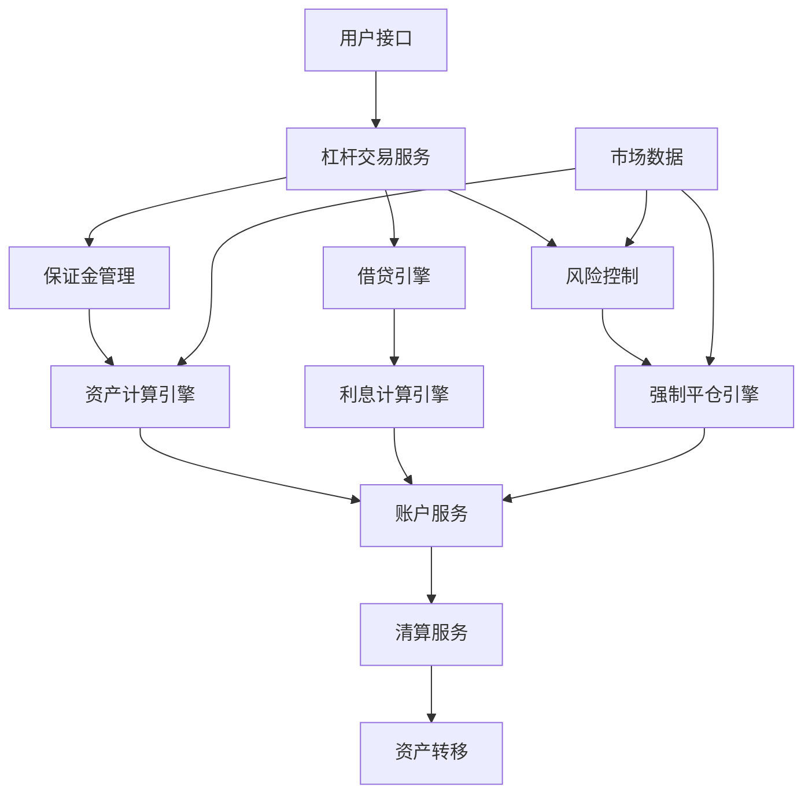

# 数字货币杠杆交易系统技术原理

## 目录
1. [杠杆交易系统架构](#杠杆交易系统架构)
2. [保证金机制与计算](#保证金机制与计算)
3. [借贷系统设计](#借贷系统设计)
4. [利息计算与清算](#利息计算与清算)
5. [强制平仓机制](#强制平仓机制)
6. [风险管理系统](#风险管理系统)
7. [杠杆倍数控制](#杠杆倍数控制)
8. [资产隔离与安全](#资产隔离与安全)
9. [清算引擎设计](#清算引擎设计)
10. [性能优化与监控](#性能优化与监控)

---

## 杠杆交易系统架构

### 1. 整体架构设计

#### 杠杆交易核心组件


#### 数据流架构
```python
class MarginTradingSystem:
    def __init__(self):
        self.margin_calculator = MarginCalculator()
        self.lending_engine = LendingEngine()
        self.risk_manager = RiskManager()
        self.liquidation_engine = LiquidationEngine()
        self.interest_calculator = InterestCalculator()
        
    def process_margin_order(self, order):
        """处理杠杆订单"""
        # 1. 风险检查
        risk_result = self.risk_manager.check_order_risk(order)
        if not risk_result.approved:
            return OrderResult.REJECTED(risk_result.reason)
        
        # 2. 保证金计算
        margin_required = self.margin_calculator.calculate_required_margin(order)
        
        # 3. 借贷检查
        if order.requires_borrowing():
            borrow_result = self.lending_engine.check_borrowing_capacity(
                order.user_id, order.borrow_amount, order.borrow_currency
            )
            if not borrow_result.approved:
                return OrderResult.REJECTED("借贷额度不足")
        
        # 4. 执行订单
        return self.execute_margin_order(order, margin_required)
```

### 2. 账户模型设计

#### 杠杆账户结构
```python
class MarginAccount:
    def __init__(self, user_id):
        self.user_id = user_id
        self.assets = {}           # {currency: AssetBalance}
        self.liabilities = {}      # {currency: LiabilityBalance}
        self.positions = {}        # {symbol: Position}
        self.margin_level = 0.0    # 保证金水平
        self.risk_level = RiskLevel.LOW
        self.max_leverage = 3.0    # 最大杠杆倍数
        
    def calculate_total_asset_value(self, base_currency='USDT'):
        """计算总资产价值"""
        total_value = Decimal('0')
        
        for currency, balance in self.assets.items():
            if currency == base_currency:
                total_value += balance.total
            else:
                price = self.get_price(f"{currency}/{base_currency}")
                total_value += balance.total * price
        
        return total_value
    
    def calculate_total_liability_value(self, base_currency='USDT'):
        """计算总负债价值"""
        total_liability = Decimal('0')
        
        for currency, liability in self.liabilities.items():
            if currency == base_currency:
                total_liability += liability.principal + liability.interest
            else:
                price = self.get_price(f"{currency}/{base_currency}")
                total_liability += (liability.principal + liability.interest) * price
        
        return total_liability
    
    def calculate_net_asset_value(self, base_currency='USDT'):
        """计算净资产价值"""
        total_assets = self.calculate_total_asset_value(base_currency)
        total_liabilities = self.calculate_total_liability_value(base_currency)
        return total_assets - total_liabilities
    
    def calculate_margin_level(self):
        """计算保证金水平"""
        net_assets = self.calculate_net_asset_value()
        total_liabilities = self.calculate_total_liability_value()
        
        if total_liabilities > 0:
            self.margin_level = float(net_assets / total_liabilities)
        else:
            self.margin_level = float('inf')  # 无负债
        
        return self.margin_level

class AssetBalance:
    def __init__(self, currency):
        self.currency = currency
        self.available = Decimal('0')    # 可用余额
        self.frozen = Decimal('0')       # 冻结余额
        self.borrowed = Decimal('0')     # 借入金额
        
    @property
    def total(self):
        return self.available + self.frozen
    
    @property
    def net(self):
        return self.total - self.borrowed

class LiabilityBalance:
    def __init__(self, currency):
        self.currency = currency
        self.principal = Decimal('0')    # 本金
        self.interest = Decimal('0')     # 利息
        self.last_interest_time = time.time()
        
    @property
    def total_debt(self):
        return self.principal + self.interest
```

---

## 保证金机制与计算

### 1. 保证金计算引擎

#### 动态保证金计算
```python
class MarginCalculator:
    def __init__(self):
        self.risk_parameters = self.load_risk_parameters()
        self.price_service = PriceService()
        
    def calculate_required_margin(self, order):
        """计算所需保证金"""
        symbol = order.symbol
        base_currency, quote_currency = symbol.split('/')
        
        # 获取风险参数
        risk_params = self.risk_parameters[symbol]
        
        # 计算订单价值
        order_value = order.quantity * order.price
        
        # 基础保证金率
        base_margin_rate = risk_params['base_margin_rate']
        
        # 波动率调整
        volatility_adjustment = self.calculate_volatility_adjustment(symbol)
        
        # 流动性调整
        liquidity_adjustment = self.calculate_liquidity_adjustment(symbol)
        
        # 综合保证金率
        total_margin_rate = (base_margin_rate + 
                           volatility_adjustment + 
                           liquidity_adjustment)
        
        required_margin = order_value * total_margin_rate
        
        return MarginRequirement(
            base_margin=order_value * base_margin_rate,
            volatility_margin=order_value * volatility_adjustment,
            liquidity_margin=order_value * liquidity_adjustment,
            total_margin=required_margin,
            margin_rate=total_margin_rate
        )
    
    def calculate_volatility_adjustment(self, symbol, lookback_days=30):
        """计算波动率调整"""
        historical_prices = self.price_service.get_historical_prices(
            symbol, lookback_days
        )
        
        if len(historical_prices) < 2:
            return 0.0
        
        # 计算历史波动率
        returns = []
        for i in range(1, len(historical_prices)):
            ret = (historical_prices[i] - historical_prices[i-1]) / historical_prices[i-1]
            returns.append(ret)
        
        volatility = np.std(returns) * np.sqrt(365)  # 年化波动率
        
        # 波动率分级调整
        if volatility < 0.2:
            return 0.0
        elif volatility < 0.5:
            return 0.01
        elif volatility < 1.0:
            return 0.02
        else:
            return 0.05
    
    def calculate_position_margin(self, account):
        """计算持仓保证金"""
        total_margin = Decimal('0')
        
        for symbol, position in account.positions.items():
            if position.quantity == 0:
                continue
                
            # 获取当前价格
            current_price = self.price_service.get_current_price(symbol)
            
            # 计算持仓价值
            position_value = abs(position.quantity) * current_price
            
            # 获取保证金率
            margin_rate = self.get_maintenance_margin_rate(symbol)
            
            # 计算持仓保证金
            position_margin = position_value * margin_rate
            total_margin += position_margin
        
        return total_margin
```

#### 维持保证金监控
```python
class MaintenanceMarginMonitor:
    def __init__(self):
        self.margin_calculator = MarginCalculator()
        self.alert_thresholds = {
            'warning': 1.3,    # 130%
            'danger': 1.1,     # 110%
            'liquidation': 1.0  # 100%
        }
    
    def monitor_account_margin(self, account):
        """监控账户保证金水平"""
        # 计算当前保证金水平
        margin_level = account.calculate_margin_level()
        
        # 计算所需维持保证金
        required_margin = self.margin_calculator.calculate_position_margin(account)
        
        # 计算可用保证金
        available_margin = account.calculate_net_asset_value()
        
        # 保证金充足率
        margin_ratio = float(available_margin / required_margin) if required_margin > 0 else float('inf')
        
        # 风险等级判断
        risk_level = self.determine_risk_level(margin_ratio)
        
        return MarginStatus(
            margin_level=margin_level,
            margin_ratio=margin_ratio,
            required_margin=required_margin,
            available_margin=available_margin,
            risk_level=risk_level
        )
    
    def determine_risk_level(self, margin_ratio):
        """确定风险等级"""
        if margin_ratio <= self.alert_thresholds['liquidation']:
            return RiskLevel.LIQUIDATION
        elif margin_ratio <= self.alert_thresholds['danger']:
            return RiskLevel.DANGER
        elif margin_ratio <= self.alert_thresholds['warning']:
            return RiskLevel.WARNING
        else:
            return RiskLevel.SAFE
```

### 2. 保证金调用机制

#### 追加保证金通知
```python
class MarginCallSystem:
    def __init__(self):
        self.notification_service = NotificationService()
        self.margin_monitor = MaintenanceMarginMonitor()
        
    def check_margin_call(self, account):
        """检查是否需要追加保证金"""
        margin_status = self.margin_monitor.monitor_account_margin(account)
        
        if margin_status.risk_level >= RiskLevel.WARNING:
            margin_call = MarginCall(
                user_id=account.user_id,
                current_margin_ratio=margin_status.margin_ratio,
                required_margin=margin_status.required_margin,
                shortfall=max(0, margin_status.required_margin - margin_status.available_margin),
                deadline=time.time() + 3600,  # 1小时内补充
                risk_level=margin_status.risk_level
            )
            
            self.send_margin_call_notification(margin_call)
            return margin_call
        
        return None
    
    def send_margin_call_notification(self, margin_call):
        """发送追加保证金通知"""
        message = self.format_margin_call_message(margin_call)
        
        # 多渠道通知
        self.notification_service.send_email(margin_call.user_id, message)
        self.notification_service.send_sms(margin_call.user_id, message)
        self.notification_service.send_push_notification(margin_call.user_id, message)
        
        # 记录通知历史
        self.save_margin_call_record(margin_call)
    
    def format_margin_call_message(self, margin_call):
        """格式化追加保证金消息"""
        if margin_call.risk_level == RiskLevel.LIQUIDATION:
            urgency = "紧急"
            action = "立即"
        elif margin_call.risk_level == RiskLevel.DANGER:
            urgency = "重要"
            action = "尽快"
        else:
            urgency = "提醒"
            action = "及时"
        
        return f"""
        【{urgency}】保证金不足通知
        
        您的杠杆账户保证金水平已降至 {margin_call.current_margin_ratio:.2%}
        需要{action}补充保证金 {margin_call.shortfall:.2f} USDT
        
        请在 {datetime.fromtimestamp(margin_call.deadline)} 前完成补充，
        否则系统将执行强制平仓。
        """
```

---

## 借贷系统设计

### 1. 借贷引擎架构

#### 借贷池管理
```python
class LendingPool:
    def __init__(self, currency):
        self.currency = currency
        self.total_supply = Decimal('0')      # 总供应量
        self.total_borrowed = Decimal('0')    # 总借出量
        self.utilization_rate = Decimal('0')  # 利用率
        self.supply_rate = Decimal('0')       # 存款利率
        self.borrow_rate = Decimal('0')       # 借款利率
        self.reserve_factor = Decimal('0.1')  # 准备金率
        
    def calculate_utilization_rate(self):
        """计算利用率"""
        if self.total_supply > 0:
            self.utilization_rate = self.total_borrowed / self.total_supply
        else:
            self.utilization_rate = Decimal('0')
        return self.utilization_rate
    
    def calculate_interest_rates(self):
        """计算利率"""
        utilization = self.calculate_utilization_rate()
        
        # 借款利率模型 (分段线性)
        if utilization <= Decimal('0.8'):
            # 低利用率区间
            self.borrow_rate = Decimal('0.02') + utilization * Decimal('0.15')
        else:
            # 高利用率区间 (陡峭上升)
            excess_utilization = utilization - Decimal('0.8')
            self.borrow_rate = (Decimal('0.14') + 
                              excess_utilization * Decimal('0.6'))
        
        # 存款利率 = 借款利率 * 利用率 * (1 - 准备金率)
        self.supply_rate = (self.borrow_rate * utilization * 
                          (Decimal('1') - self.reserve_factor))
        
        return {
            'borrow_rate': self.borrow_rate,
            'supply_rate': self.supply_rate,
            'utilization_rate': utilization
        }

class LendingEngine:
    def __init__(self):
        self.lending_pools = {}  # {currency: LendingPool}
        self.user_positions = {}  # {user_id: {currency: Position}}
        
    def borrow(self, user_id, currency, amount):
        """借款操作"""
        pool = self.lending_pools[currency]
        
        # 检查可借额度
        available_liquidity = pool.total_supply - pool.total_borrowed
        if amount > available_liquidity:
            return BorrowResult.FAILED("流动性不足")
        
        # 检查用户借款能力
        user_capacity = self.calculate_borrow_capacity(user_id, currency)
        if amount > user_capacity:
            return BorrowResult.FAILED("借款能力不足")
        
        # 执行借款
        pool.total_borrowed += amount
        
        # 更新用户借款记录
        if user_id not in self.user_positions:
            self.user_positions[user_id] = {}
        
        if currency not in self.user_positions[user_id]:
            self.user_positions[user_id][currency] = BorrowPosition(currency)
        
        position = self.user_positions[user_id][currency]
        position.principal += amount
        position.last_update_time = time.time()
        
        # 更新利率
        pool.calculate_interest_rates()
        
        return BorrowResult.SUCCESS(amount)
    
    def calculate_borrow_capacity(self, user_id, currency):
        """计算借款能力"""
        account = self.get_margin_account(user_id)
        
        # 计算净资产价值
        net_asset_value = account.calculate_net_asset_value()
        
        # 计算已借款价值
        total_borrowed_value = account.calculate_total_liability_value()
        
        # 最大借款能力 = 净资产 * 最大杠杆倍数 - 已借款
        max_borrow_capacity = (net_asset_value * account.max_leverage - 
                             total_borrowed_value)
        
        # 转换为目标货币
        if currency != 'USDT':
            price = self.get_price(f"{currency}/USDT")
            max_borrow_capacity = max_borrow_capacity / price
        
        return max(Decimal('0'), max_borrow_capacity)
```

#### 自动借还机制
```python
class AutoBorrowRepaySystem:
    def __init__(self):
        self.lending_engine = LendingEngine()
        self.margin_calculator = MarginCalculator()
        
    def auto_borrow_for_order(self, order):
        """为订单自动借款"""
        required_amount = self.calculate_required_borrow_amount(order)
        
        if required_amount <= 0:
            return AutoBorrowResult.NOT_NEEDED()
        
        # 确定借款货币
        if order.side == 'BUY':
            borrow_currency = order.quote_currency
        else:
            borrow_currency = order.base_currency
        
        # 执行自动借款
        borrow_result = self.lending_engine.borrow(
            order.user_id, borrow_currency, required_amount
        )
        
        if borrow_result.success:
            return AutoBorrowResult.SUCCESS(borrow_currency, required_amount)
        else:
            return AutoBorrowResult.FAILED(borrow_result.error_message)
    
    def auto_repay_after_trade(self, trade):
        """交易后自动还款"""
        user_id = trade.user_id
        
        # 获取用户借款情况
        user_positions = self.lending_engine.user_positions.get(user_id, {})
        
        for currency, position in user_positions.items():
            if position.principal > 0:
                # 检查是否有足够余额还款
                available_balance = self.get_available_balance(user_id, currency)
                
                if available_balance > 0:
                    repay_amount = min(available_balance, position.principal)
                    self.lending_engine.repay(user_id, currency, repay_amount)
    
    def calculate_required_borrow_amount(self, order):
        """计算所需借款金额"""
        user_id = order.user_id
        
        if order.side == 'BUY':
            # 买单需要报价货币
            required_currency = order.quote_currency
            required_amount = order.quantity * order.price
        else:
            # 卖单需要基础货币
            required_currency = order.base_currency
            required_amount = order.quantity
        
        # 检查可用余额
        available_balance = self.get_available_balance(user_id, required_currency)
        
        # 计算需要借款的金额
        borrow_amount = max(Decimal('0'), required_amount - available_balance)
        
        return borrow_amount
```

---

## 利息计算与清算

### 1. 利息计算引擎

#### 复利计算算法
```python
class InterestCalculator:
    def __init__(self):
        self.compound_frequency = 24  # 每日复利24次 (每小时)
        
    def calculate_compound_interest(self, principal, rate, time_hours):
        """计算复利"""
        # 年利率转换为小时利率
        hourly_rate = rate / (365 * 24)
        
        # 复利公式: A = P(1 + r/n)^(nt)
        # P: 本金, r: 年利率, n: 复利频率, t: 时间(年)
        n = self.compound_frequency
        t = time_hours / (365 * 24)  # 转换为年
        
        amount = principal * ((1 + hourly_rate / n) ** (n * t))
        interest = amount - principal
        
        return interest
    
    def calculate_accrued_interest(self, borrow_position, current_time):
        """计算应计利息"""
        if borrow_position.principal <= 0:
            return Decimal('0')
        
        # 计算时间差 (小时)
        time_diff = (current_time - borrow_position.last_update_time) / 3600
        
        # 获取当前利率
        current_rate = self.get_current_borrow_rate(borrow_position.currency)
        
        # 计算新增利息
        new_interest = self.calculate_compound_interest(
            borrow_position.principal + borrow_position.accrued_interest,
            current_rate,
            time_diff
        )
        
        return new_interest
    
    def update_all_positions_interest(self):
        """更新所有借款头寸的利息"""
        current_time = time.time()
        
        for user_id, positions in self.lending_engine.user_positions.items():
            for currency, position in positions.items():
                # 计算应计利息
                new_interest = self.calculate_accrued_interest(position, current_time)
                
                # 更新头寸
                position.accrued_interest += new_interest
                position.last_update_time = current_time
                
                # 记录利息历史
                self.record_interest_accrual(user_id, currency, new_interest)

class BorrowPosition:
    def __init__(self, currency):
        self.currency = currency
        self.principal = Decimal('0')
        self.accrued_interest = Decimal('0')
        self.last_update_time = time.time()
        self.interest_history = []
        
    @property
    def total_debt(self):
        return self.principal + self.accrued_interest
    
    def add_interest_record(self, amount, rate, timestamp):
        """添加利息记录"""
        self.interest_history.append({
            'amount': amount,
            'rate': rate,
            'timestamp': timestamp,
            'cumulative_interest': self.accrued_interest
        })
```

#### 利息清算机制
```python
class InterestSettlement:
    def __init__(self):
        self.interest_calculator = InterestCalculator()
        self.settlement_frequency = 3600  # 每小时清算一次
        
    def settle_interest_batch(self, user_ids=None):
        """批量利息清算"""
        current_time = time.time()
        settlement_results = []
        
        # 获取需要清算的用户
        if user_ids is None:
            user_ids = self.get_all_borrowing_users()
        
        for user_id in user_ids:
            try:
                result = self.settle_user_interest(user_id, current_time)
                settlement_results.append(result)
            except Exception as e:
                self.log_settlement_error(user_id, str(e))
                settlement_results.append(
                    SettlementResult.FAILED(user_id, str(e))
                )
        
        return settlement_results
    
    def settle_user_interest(self, user_id, settlement_time):
        """清算单个用户利息"""
        account = self.get_margin_account(user_id)
        positions = self.lending_engine.user_positions.get(user_id, {})
        
        total_interest_settled = Decimal('0')
        settlement_details = []
        
        for currency, position in positions.items():
            if position.principal > 0:
                # 计算应付利息
                interest_due = self.interest_calculator.calculate_accrued_interest(
                    position, settlement_time
                )
                
                if interest_due > 0:
                    # 从账户扣除利息
                    deduction_result = self.deduct_interest_from_account(
                        account, currency, interest_due
                    )
                    
                    if deduction_result.success:
                        # 更新借款头寸
                        position.accrued_interest = Decimal('0')
                        position.last_update_time = settlement_time
                        
                        total_interest_settled += interest_due
                        settlement_details.append({
                            'currency': currency,
                            'interest_amount': interest_due,
                            'status': 'SETTLED'
                        })
                    else:
                        # 利息无法支付，累积到应付利息
                        position.accrued_interest += interest_due
                        settlement_details.append({
                            'currency': currency,
                            'interest_amount': interest_due,
                            'status': 'DEFERRED'
                        })
        
        return SettlementResult.SUCCESS(
            user_id, total_interest_settled, settlement_details
        )
    
    def deduct_interest_from_account(self, account, currency, amount):
        """从账户扣除利息"""
        available_balance = account.assets.get(currency, AssetBalance(currency)).available
        
        if available_balance >= amount:
            # 直接扣除
            account.assets[currency].available -= amount
            return DeductionResult.SUCCESS(amount)
        else:
            # 余额不足，尝试自动还款或标记为逾期
            return self.handle_insufficient_balance_for_interest(
                account, currency, amount, available_balance
            )
```

---

## 强制平仓机制

### 1. 强制平仓引擎

#### 平仓触发条件
```python
class LiquidationEngine:
    def __init__(self):
        self.margin_monitor = MaintenanceMarginMonitor()
        self.liquidation_thresholds = {
            'maintenance_margin_ratio': 1.1,  # 维持保证金率110%
            'liquidation_margin_ratio': 1.0,  # 强平保证金率100%
        }
        
    def check_liquidation_conditions(self, account):
        """检查强制平仓条件"""
        margin_status = self.margin_monitor.monitor_account_margin(account)
        
        conditions = []
        
        # 条件1: 保证金率低于强平线
        if margin_status.margin_ratio <= self.liquidation_thresholds['liquidation_margin_ratio']:
            conditions.append(LiquidationCondition(
                type='MARGIN_RATIO',
                current_value=margin_status.margin_ratio,
                threshold=self.liquidation_thresholds['liquidation_margin_ratio'],
                severity='CRITICAL'
            ))
        
        # 条件2: 净资产为负
        net_asset_value = account.calculate_net_asset_value()
        if net_asset_value <= 0:
            conditions.append(LiquidationCondition(
                type='NEGATIVE_EQUITY',
                current_value=float(net_asset_value),
                threshold=0.0,
                severity='CRITICAL'
            ))
        
        # 条件3: 逾期利息过多
        overdue_interest = self.calculate_overdue_interest(account)
        if overdue_interest > account.calculate_total_asset_value() * Decimal('0.1'):
            conditions.append(LiquidationCondition(
                type='OVERDUE_INTEREST',
                current_value=float(overdue_interest),
                threshold=float(account.calculate_total_asset_value() * Decimal('0.1')),
                severity='HIGH'
            ))
        
        return conditions
    
    def execute_liquidation(self, account, conditions):
        """执行强制平仓"""
        liquidation_id = self.generate_liquidation_id()
        
        try:
            # 1. 冻结账户
            self.freeze_account_for_liquidation(account.user_id)
            
            # 2. 计算平仓策略
            liquidation_plan = self.create_liquidation_plan(account, conditions)
            
            # 3. 执行平仓订单
            liquidation_results = []
            for step in liquidation_plan.steps:
                result = self.execute_liquidation_step(step)
                liquidation_results.append(result)
                
                # 检查是否已满足条件
                if self.is_liquidation_sufficient(account):
                    break
            
            # 4. 处理剩余债务
            remaining_debt = self.handle_remaining_debt(account)
            
            # 5. 记录平仓结果
            liquidation_record = LiquidationRecord(
                liquidation_id=liquidation_id,
                user_id=account.user_id,
                conditions=conditions,
                plan=liquidation_plan,
                results
=liquidation_results,
                remaining_debt=remaining_debt,
                timestamp=time.time()
            )
            
            self.save_liquidation_record(liquidation_record)
            
            return LiquidationResult.SUCCESS(liquidation_record)
            
        except Exception as e:
            self.log_liquidation_error(account.user_id, str(e))
            return LiquidationResult.FAILED(str(e))
        finally:
            # 解冻账户 (如果平仓成功)
            if self.is_liquidation_sufficient(account):
                self.unfreeze_account(account.user_id)

class LiquidationPlan:
    def __init__(self, account):
        self.account = account
        self.steps = []
        self.total_liquidation_value = Decimal('0')
        
    def create_optimal_plan(self):
        """创建最优平仓计划"""
        positions = list(self.account.positions.values())
        
        # 按流动性和盈亏排序
        positions.sort(key=lambda p: (
            -self.get_liquidity_score(p.symbol),  # 流动性高的优先
            p.unrealized_pnl  # 亏损头寸优先
        ))
        
        for position in positions:
            if position.quantity != 0:
                step = LiquidationStep(
                    symbol=position.symbol,
                    side='SELL' if position.quantity > 0 else 'BUY',
                    quantity=abs(position.quantity),
                    expected_price=self.get_liquidation_price(position.symbol),
                    priority=self.calculate_priority(position)
                )
                self.steps.append(step)
        
        return self

class LiquidationStep:
    def __init__(self, symbol, side, quantity, expected_price, priority):
        self.symbol = symbol
        self.side = side
        self.quantity = quantity
        self.expected_price = expected_price
        self.priority = priority
        self.status = 'PENDING'
        self.actual_price = None
        self.executed_quantity = Decimal('0')
```

#### 平仓订单执行
```python
class LiquidationOrderExecutor:
    def __init__(self):
        self.order_service = OrderService()
        self.market_data_service = MarketDataService()
        
    def execute_liquidation_step(self, step):
        """执行平仓步骤"""
        try:
            # 获取当前市场深度
            order_book = self.market_data_service.get_order_book(step.symbol)
            
            # 计算最优执行策略
            execution_strategy = self.calculate_execution_strategy(step, order_book)
            
            if execution_strategy.type == 'MARKET_ORDER':
                return self.execute_market_liquidation(step, execution_strategy)
            elif execution_strategy.type == 'ICEBERG_ORDER':
                return self.execute_iceberg_liquidation(step, execution_strategy)
            else:
                return self.execute_limit_liquidation(step, execution_strategy)
                
        except Exception as e:
            return LiquidationStepResult.FAILED(step, str(e))
    
    def execute_market_liquidation(self, step, strategy):
        """市价单平仓"""
        order = MarketOrder(
            symbol=step.symbol,
            side=step.side,
            quantity=step.quantity,
            user_id=step.account.user_id,
            order_type='LIQUIDATION'
        )
        
        result = self.order_service.execute_order(order)
        
        if result.success:
            step.status = 'COMPLETED'
            step.actual_price = result.average_price
            step.executed_quantity = result.executed_quantity
            
            return LiquidationStepResult.SUCCESS(step, result)
        else:
            return LiquidationStepResult.FAILED(step, result.error_message)
    
    def execute_iceberg_liquidation(self, step, strategy):
        """冰山订单平仓 (大额头寸)"""
        total_quantity = step.quantity
        chunk_size = strategy.chunk_size
        executed_results = []
        
        while total_quantity > 0:
            current_chunk = min(chunk_size, total_quantity)
            
            chunk_order = LimitOrder(
                symbol=step.symbol,
                side=step.side,
                quantity=current_chunk,
                price=strategy.price,
                user_id=step.account.user_id,
                order_type='LIQUIDATION_CHUNK'
            )
            
            result = self.order_service.execute_order(chunk_order)
            executed_results.append(result)
            
            if result.success:
                total_quantity -= result.executed_quantity
                step.executed_quantity += result.executed_quantity
            else:
                # 如果限价单失败，改用市价单
                market_order = MarketOrder(
                    symbol=step.symbol,
                    side=step.side,
                    quantity=current_chunk,
                    user_id=step.account.user_id,
                    order_type='LIQUIDATION_MARKET'
                )
                
                market_result = self.order_service.execute_order(market_order)
                executed_results.append(market_result)
                
                if market_result.success:
                    total_quantity -= market_result.executed_quantity
                    step.executed_quantity += market_result.executed_quantity
                else:
                    break
        
        # 计算平均执行价格
        total_value = sum(r.executed_quantity * r.average_price for r in executed_results if r.success)
        total_qty = sum(r.executed_quantity for r in executed_results if r.success)
        
        if total_qty > 0:
            step.actual_price = total_value / total_qty
            step.status = 'COMPLETED' if step.executed_quantity == step.quantity else 'PARTIAL'
            return LiquidationStepResult.SUCCESS(step, executed_results)
        else:
            return LiquidationStepResult.FAILED(step, "所有订单执行失败")
```

### 2. 部分平仓策略

#### 智能部分平仓
```python
class PartialLiquidationStrategy:
    def __init__(self):
        self.target_margin_ratio = 1.5  # 目标保证金率150%
        
    def calculate_partial_liquidation(self, account):
        """计算部分平仓方案"""
        current_margin_ratio = account.calculate_margin_level()
        
        if current_margin_ratio >= self.target_margin_ratio:
            return None  # 无需平仓
        
        # 计算需要释放的保证金
        required_margin = self.margin_calculator.calculate_position_margin(account)
        current_net_assets = account.calculate_net_asset_value()
        
        target_net_assets = required_margin * self.target_margin_ratio
        liquidation_amount = target_net_assets - current_net_assets
        
        # 选择平仓头寸
        liquidation_candidates = self.select_liquidation_candidates(
            account, liquidation_amount
        )
        
        return PartialLiquidationPlan(
            target_amount=liquidation_amount,
            candidates=liquidation_candidates,
            target_margin_ratio=self.target_margin_ratio
        )
    
    def select_liquidation_candidates(self, account, target_amount):
        """选择平仓候选头寸"""
        positions = list(account.positions.values())
        candidates = []
        
        # 计算每个头寸的平仓优先级
        for position in positions:
            if position.quantity == 0:
                continue
                
            score = self.calculate_liquidation_score(position)
            candidates.append(LiquidationCandidate(
                position=position,
                score=score,
                estimated_value=self.estimate_liquidation_value(position)
            ))
        
        # 按优先级排序
        candidates.sort(key=lambda c: c.score, reverse=True)
        
        # 选择足够的头寸以达到目标金额
        selected_candidates = []
        accumulated_value = Decimal('0')
        
        for candidate in candidates:
            if accumulated_value >= target_amount:
                break
                
            selected_candidates.append(candidate)
            accumulated_value += candidate.estimated_value
        
        return selected_candidates
    
    def calculate_liquidation_score(self, position):
        """计算平仓优先级得分"""
        # 因子1: 流动性 (流动性越好，得分越高)
        liquidity_score = self.get_liquidity_score(position.symbol)
        
        # 因子2: 盈亏状况 (亏损头寸优先)
        pnl_score = -position.unrealized_pnl if position.unrealized_pnl < 0 else 0
        
        # 因子3: 头寸大小 (大头寸优先)
        size_score = abs(position.quantity * position.average_price)
        
        # 因子4: 波动率 (高波动率优先)
        volatility_score = self.get_volatility_score(position.symbol)
        
        # 加权计算总得分
        total_score = (
            liquidity_score * 0.4 +
            pnl_score * 0.3 +
            size_score * 0.2 +
            volatility_score * 0.1
        )
        
        return total_score
```

---

## 风险管理系统

### 1. 实时风险监控

#### 风险指标计算
```python
class MarginRiskManager:
    def __init__(self):
        self.risk_metrics = {}
        self.alert_thresholds = self.load_risk_thresholds()
        
    def calculate_portfolio_risk(self, account):
        """计算投资组合风险"""
        positions = account.positions
        
        # VaR计算 (Value at Risk)
        var_95 = self.calculate_var(positions, confidence_level=0.95)
        var_99 = self.calculate_var(positions, confidence_level=0.99)
        
        # 最大回撤
        max_drawdown = self.calculate_max_drawdown(account)
        
        # 集中度风险
        concentration_risk = self.calculate_concentration_risk(positions)
        
        # 流动性风险
        liquidity_risk = self.calculate_liquidity_risk(positions)
        
        return PortfolioRisk(
            var_95=var_95,
            var_99=var_99,
            max_drawdown=max_drawdown,
            concentration_risk=concentration_risk,
            liquidity_risk=liquidity_risk,
            overall_risk_score=self.calculate_overall_risk_score(
                var_95, max_drawdown, concentration_risk, liquidity_risk
            )
        )
    
    def calculate_var(self, positions, confidence_level=0.95, time_horizon_days=1):
        """计算风险价值 (VaR)"""
        if not positions:
            return Decimal('0')
        
        # 获取历史价格数据
        price_data = {}
        for symbol, position in positions.items():
            if position.quantity != 0:
                price_data[symbol] = self.get_historical_prices(symbol, days=252)
        
        # 计算收益率矩阵
        returns_matrix = self.calculate_returns_matrix(price_data)
        
        # 计算投资组合权重
        portfolio_weights = self.calculate_portfolio_weights(positions)
        
        # 蒙特卡洛模拟
        num_simulations = 10000
        portfolio_returns = []
        
        for _ in range(num_simulations):
            # 随机抽样历史收益率
            random_returns = self.sample_random_returns(returns_matrix)
            
            # 计算投资组合收益
            portfolio_return = sum(
                weight * random_returns.get(symbol, 0)
                for symbol, weight in portfolio_weights.items()
            )
            
            portfolio_returns.append(portfolio_return)
        
        # 计算VaR
        portfolio_returns.sort()
        var_index = int((1 - confidence_level) * num_simulations)
        var_return = portfolio_returns[var_index]
        
        # 转换为货币金额
        portfolio_value = sum(
            abs(pos.quantity * pos.current_price)
            for pos in positions.values()
        )
        
        var_amount = portfolio_value * abs(var_return) * np.sqrt(time_horizon_days)
        
        return var_amount
    
    def calculate_concentration_risk(self, positions):
        """计算集中度风险"""
        if not positions:
            return Decimal('0')
        
        # 计算每个头寸的权重
        total_value = sum(
            abs(pos.quantity * pos.current_price)
            for pos in positions.values()
        )
        
        if total_value == 0:
            return Decimal('0')
        
        weights = []
        for position in positions.values():
            weight = abs(position.quantity * position.current_price) / total_value
            weights.append(weight)
        
        # 计算赫芬达尔指数 (HHI)
        hhi = sum(w ** 2 for w in weights)
        
        # 标准化到0-1范围
        max_hhi = 1.0  # 完全集中
        min_hhi = 1.0 / len(weights) if weights else 0  # 完全分散
        
        if max_hhi > min_hhi:
            concentration_score = (hhi - min_hhi) / (max_hhi - min_hhi)
        else:
            concentration_score = 0
        
        return Decimal(str(concentration_score))
```

#### 动态风险限额
```python
class DynamicRiskLimits:
    def __init__(self):
        self.base_limits = self.load_base_limits()
        self.market_volatility_factor = 1.0
        self.user_risk_factors = {}
        
    def calculate_dynamic_limits(self, user_id):
        """计算动态风险限额"""
        base_limits = self.base_limits.copy()
        
        # 市场波动率调整
        market_adjustment = self.calculate_market_volatility_adjustment()
        
        # 用户风险评级调整
        user_risk_factor = self.get_user_risk_factor(user_id)
        
        # 历史表现调整
        performance_adjustment = self.calculate_performance_adjustment(user_id)
        
        # 应用调整因子
        adjusted_limits = {}
        for limit_type, base_value in base_limits.items():
            adjusted_value = (base_value * 
                            market_adjustment * 
                            user_risk_factor * 
                            performance_adjustment)
            
            adjusted_limits[limit_type] = max(
                adjusted_value, 
                base_value * 0.1  # 最小限额为基础限额的10%
            )
        
        return RiskLimits(
            max_leverage=adjusted_limits['max_leverage'],
            max_position_size=adjusted_limits['max_position_size'],
            max_daily_loss=adjusted_limits['max_daily_loss'],
            max_concentration=adjusted_limits['max_concentration']
        )
    
    def calculate_market_volatility_adjustment(self):
        """计算市场波动率调整因子"""
        # 获取市场整体波动率
        market_volatility = self.get_market_volatility_index()
        
        # 波动率分级调整
        if market_volatility < 0.2:
            return 1.2  # 低波动率，放宽限制
        elif market_volatility < 0.4:
            return 1.0  # 正常波动率
        elif market_volatility < 0.6:
            return 0.8  # 高波动率，收紧限制
        else:
            return 0.6  # 极高波动率，严格限制
    
    def calculate_performance_adjustment(self, user_id, lookback_days=30):
        """基于历史表现计算调整因子"""
        performance_metrics = self.get_user_performance_metrics(user_id, lookback_days)
        
        # 盈利稳定性
        profit_stability = performance_metrics.profit_stability_score
        
        # 最大回撤控制
        drawdown_control = performance_metrics.drawdown_control_score
        
        # 风险管理纪律
        risk_discipline = performance_metrics.risk_discipline_score
        
        # 综合评分
        overall_score = (profit_stability * 0.4 + 
                        drawdown_control * 0.4 + 
                        risk_discipline * 0.2)
        
        # 转换为调整因子 (0.5 - 1.5)
        adjustment_factor = 0.5 + overall_score
        
        return adjustment_factor
```

### 2. 预警系统

#### 多级预警机制
```python
class RiskAlertSystem:
    def __init__(self):
        self.alert_levels = {
            'INFO': 1,
            'WARNING': 2,
            'DANGER': 3,
            'CRITICAL': 4
        }
        self.notification_channels = ['email', 'sms', 'push', 'webhook']
        
    def monitor_account_risks(self, account):
        """监控账户风险"""
        alerts = []
        
        # 保证金水平检查
        margin_alerts = self.check_margin_level_alerts(account)
        alerts.extend(margin_alerts)
        
        # 头寸集中度检查
        concentration_alerts = self.check_concentration_alerts(account)
        alerts.extend(concentration_alerts)
        
        # 流动性风险检查
        liquidity_alerts = self.check_liquidity_alerts(account)
        alerts.extend(liquidity_alerts)
        
        # 异常交易行为检查
        behavior_alerts = self.check_trading_behavior_alerts(account)
        alerts.extend(behavior_alerts)
        
        # 发送预警
        for alert in alerts:
            self.send_alert(alert)
        
        return alerts
    
    def check_margin_level_alerts(self, account):
        """检查保证金水平预警"""
        alerts = []
        margin_level = account.calculate_margin_level()
        
        if margin_level <= 1.0:
            alerts.append(RiskAlert(
                type='MARGIN_LEVEL',
                level='CRITICAL',
                message=f'保证金水平极低: {margin_level:.2%}，面临强制平仓风险',
                user_id=account.user_id,
                data={'margin_level': margin_level}
            ))
        elif margin_level <= 1.1:
            alerts.append(RiskAlert(
                type='MARGIN_LEVEL',
                level='DANGER',
                message=f'保证金水平过低: {margin_level:.2%}，请及时补充保证金',
                user_id=account.user_id,
                data={'margin_level': margin_level}
            ))
        elif margin_level <= 1.3:
            alerts.append(RiskAlert(
                type='MARGIN_LEVEL',
                level='WARNING',
                message=f'保证金水平偏低: {margin_level:.2%}，建议关注风险',
                user_id=account.user_id,
                data={'margin_level': margin_level}
            ))
        
        return alerts
    
    def send_alert(self, alert):
        """发送风险预警"""
        # 根据预警级别选择通知渠道
        channels = self.get_notification_channels(alert.level)
        
        for channel in channels:
            try:
                if channel == 'email':
                    self.send_email_alert(alert)
                elif channel == 'sms':
                    self.send_sms_alert(alert)
                elif channel == 'push':
                    self.send_push_alert(alert)
                elif channel == 'webhook':
                    self.send_webhook_alert(alert)
            except Exception as e:
                self.log_notification_error(alert, channel, str(e))
        
        # 记录预警历史
        self.save_alert_record(alert)
    
    def get_notification_channels(self, alert_level):
        """根据预警级别获取通知渠道"""
        if alert_level == 'CRITICAL':
            return ['email', 'sms', 'push', 'webhook']
        elif alert_level == 'DANGER':
            return ['email', 'push', 'webhook']
        elif alert_level == 'WARNING':
            return ['push', 'webhook']
        else:
            return ['webhook']
```

---

## 杠杆倍数控制

### 1. 动态杠杆管理

#### 杠杆倍数计算
```python
class LeverageController:
    def __init__(self):
        self.max_leverage_by_symbol = self.load_symbol_leverage_config()
        self.user_leverage_limits = {}
        
    def calculate_max_leverage(self, user_id, symbol):
        """计算最大可用杠杆倍数"""
        # 基础杠杆限制
        base_max_leverage = self.max_leverage_by_symbol.get(symbol, 3.0)
        
        # 用户等级调整
        user_tier_adjustment = self.get_user_tier_leverage_adjustment(user_id)
        
        # 市场波动率调整
        volatility_adjustment = self.get_volatility_leverage_adjustment(symbol)
        
        # 流动性调整
        liquidity_adjustment = self.get_liquidity_leverage_adjustment(symbol)
        
        # 用户风险评级调整
        risk_rating_adjustment = self.get_risk_rating_adjustment(user_id)
        
        # 计算最终杠杆倍数
        max_leverage = (base_max_leverage * 
                       user_tier_adjustment * 
                       volatility_adjustment * 
                       liquidity_adjustment * 
                       risk_rating_adjustment)
        
        # 应用硬性限制
        absolute_max = self.get_absolute_max_leverage(user_id)
        max_leverage = min(max_leverage, absolute_max)
        
        return max_leverage
    
    def get_volatility_leverage_adjustment(self, symbol, lookback_days=30):
        """基于波动率的杠杆调整"""
        volatility = self.calculate_symbol_volatility(symbol, lookback_days)
        
        # 波动率分级调整
        if volatility < 0.2:
            return 1.0  # 低波动率，无调整
        elif volatility < 0.4:
            return 0.9  # 中等波动率，轻微降低
        elif volatility < 0.6:
            return 0.7  # 高波动率，显著降低
        else:
            return 0.5  # 极高波动率，大幅降低
    
    def validate_leverage_request(self, user_id, symbol, requested_leverage):
        """验证杠杆倍数请求"""
        max_allowed = self.calculate_max_leverage(user_id, symbol)
        
        if requested_leverage > max_allowed:
            return LeverageValidationResult(
                approved=False,
                max_allowed=max_allowed,
                requested=requested_leverage,
                reason=f"请求杠杆倍数{requested_leverage}x超过最大允许{max_allowed}x"
            )
        
        # 检查用户当前风险状况
        account = self.get_margin_account(user_id)
        current_risk = self.assess_current_risk(account)
        
        if current_risk.level >= RiskLevel.HIGH and requested_leverage > 2.0:
            return LeverageValidationResult(
                approved=False,
                max_allowed=2.0,
                requested=requested_leverage,
                reason="当前风险水平较高，限制杠杆倍数"
            )
        
        return LeverageValidationResult(
            approved=True,
            max_allowed=max_allowed,
            requested=requested_leverage
        )

class AdaptiveLeverageSystem:
    def __init__(self):
        self.leverage_controller = LeverageController()
        self.risk_monitor = MarginRiskManager()
        
    def adjust_leverage_dynamically(self, user_id):
        """动态调整用户杠杆倍数"""
        account = self.get_margin_account(user_id)
        
        # 评估当前风险状况
        current_risk = self.risk_monitor.calculate_portfolio_risk(account)
        
        # 计算建议杠杆倍数
        recommended_leverage = self.calculate_recommended_leverage(
            account, current_risk
        )
        
        # 检查是否需要调整
        current_leverage = self.calculate_current_leverage(account)
        
        if abs(recommended_leverage - current_leverage) > 0.5:
            # 发送杠杆调整建议
            self.send_leverage_adjustment_suggestion(
                user_id, current_leverage, recommended_leverage, current_risk
            )
        
        return LeverageAdjustmentRecommendation(
            current_leverage=current_leverage,
            recommended_leverage=recommended_leverage,
            risk_assessment=current_risk,
            adjustment_reason=self.get_adjustment_reason(current_risk)
        )
    
    def calculate_recommended_leverage(self, account, risk_assessment):
        """计算推荐杠杆倍数"""
        base_leverage = 3.0
        
        # 基于VaR调整
        if risk_assessment.var_95 > account.calculate_net_asset_value() * 0.1:
            base_leverage *= 0.7  # 高VaR，降低杠杆
        
        # 基于集中度风险调整
        if risk_assessment.concentration_risk > 0.5:
            base_leverage *= 0.8  # 高集中度，降低杠杆
        
        # 基于流动性风险调整
        if risk_assessment.liquidity_risk > 0.3:
            base_leverage *= 0.9  # 流动性风险，降低杠杆
        
        # 基于保证金水平调整
        margin_level = account.calculate_margin_level()
        if margin_level < 1.5:
            base_leverage *= 0.6  # 保证金不足，大幅降低杠杆
        elif margin_level < 2.0:
            base_leverage *= 0.8  # 保证金偏低，适度降低杠杆
        
        return max(1.0, min(base_leverage, 10.0))  # 限制在1-10倍范围内
```

---

## 总结

### 杠杆交易系统核心技术要点

1. **保证金机制**：动态保证金计算，维持保证金监控
2. **借贷系统**：利率模型，自动借还机制
3. **利息计算**：复利算法，实时清算
4. **强制平仓**：多条件触发，智能执行策略
5. **风险管理**：实时监控，动态限额调整
6. **杠杆控制**：自适应杠杆，风险评级调整

### 技术架构特点

- **实时性**：毫秒级风险计算和监控
- **准确性**：精确的保证金和利息计算
- **安全性**：多层风控，资产隔离
- **智能化**：动态调整，自适应策略
- **可扩展性**：模块化设计，易于扩展

### 风险控制重点

- **保证金充足率**：实时监控，及时预警
- **集中度风险**：分散投资，限制单一头寸
- **流动性风险**：评估市场深度，优化平仓策略
- **利率风险**：动态利率模型，合理定价

这个杠杆交易技术文档为开发者提供了完整的杠杆交易系统实现参考，涵盖了从保证金计算到风险管理的各个技术环节。

---

*本文档面向杠杆交易系统开发者，提供技术实现参考。实际开发中需要根据监管要求和业务需求进行调整。*