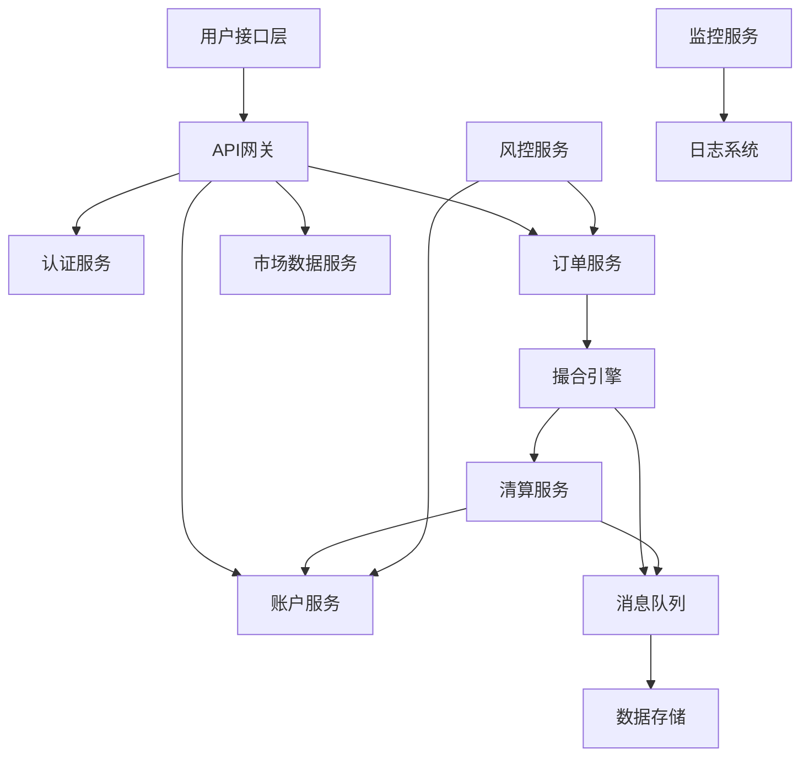

# 数字货币现货交易系统技术原理

## 目录
1. [交易系统架构概览](#交易系统架构概览)
2. [撮合引擎原理与实现](#撮合引擎原理与实现)
3. [订单管理系统](#订单管理系统)
4. [资产管理与清算系统](#资产管理与清算系统)
5. [风控系统设计](#风控系统设计)
6. [价格发现机制](#价格发现机制)
7. [流动性管理](#流动性管理)
8. [API接口设计](#api接口设计)
9. [数据存储与处理](#数据存储与处理)
10. [性能优化与扩展](#性能优化与扩展)

---

## 交易系统架构概览

### 1. 整体架构设计

#### 微服务架构图


#### 核心组件职责
1. **API网关**：请求路由、限流、认证
2. **订单服务**：订单生命周期管理
3. **撮合引擎**：订单匹配和价格发现
4. **账户服务**：资产管理和余额控制
5. **清算服务**：交易结算和资产转移
6. **风控服务**：实时风险监控和控制
7. **市场数据服务**：行情数据分发

### 2. 数据流架构

#### 订单处理流程
```
用户下单 → API验证 → 风控检查 → 冻结资产 → 进入撮合队列
    ↓
撮合成功 → 生成成交记录 → 清算服务 → 更新账户余额 → 推送成交数据
```

#### 实时数据流
```
撮合引擎 → 消息队列 → 数据分发服务 → WebSocket/HTTP推送 → 客户端
```

---

## 撮合引擎原理与实现

### 1. 撮合算法核心

#### 价格时间优先算法
```python
class MatchingEngine:
    def __init__(self):
        self.buy_orders = PriorityQueue()   # 买单队列 (价格降序)
        self.sell_orders = PriorityQueue()  # 卖单队列 (价格升序)
        
    def add_order(self, order):
        if order.side == 'BUY':
            # 买单按价格降序，时间升序排列
            priority = (-order.price, order.timestamp)
            self.buy_orders.put((priority, order))
        else:
            # 卖单按价格升序，时间升序排列
            priority = (order.price, order.timestamp)
            self.sell_orders.put((priority, order))
            
        self.match_orders()
    
    def match_orders(self):
        while (not self.buy_orders.empty() and 
               not self.sell_orders.empty()):
            
            buy_order = self.buy_orders.queue[0][1]
            sell_order = self.sell_orders.queue[0][1]
            
            # 价格匹配检查
            if buy_order.price >= sell_order.price:
                self.execute_trade(buy_order, sell_order)
            else:
                break
```

#### 订单簿数据结构
```python
class OrderBook:
    def __init__(self):
        self.bids = {}  # {price: [orders]}
        self.asks = {}  # {price: [orders]}
        self.price_levels_bid = []  # 价格层级 (降序)
        self.price_levels_ask = []  # 价格层级 (升序)
    
    def add_order(self, order):
        if order.side == 'BUY':
            if order.price not in self.bids:
                self.bids[order.price] = []
                bisect.insort(self.price_levels_bid, -order.price)
            self.bids[order.price].append(order)
        else:
            if order.price not in self.asks:
                self.asks[order.price] = []
                bisect.insort(self.price_levels_ask, order.price)
            self.asks[order.price].append(order)
```

### 2. 撮合策略实现

#### 部分成交处理
```python
def execute_trade(self, buy_order, sell_order):
    trade_quantity = min(buy_order.remaining_qty, sell_order.remaining_qty)
    trade_price = sell_order.price  # 价格以先到订单为准
    
    # 创建成交记录
    trade = Trade(
        buy_order_id=buy_order.id,
        sell_order_id=sell_order.id,
        price=trade_price,
        quantity=trade_quantity,
        timestamp=time.time()
    )
    
    # 更新订单状态
    buy_order.remaining_qty -= trade_quantity
    sell_order.remaining_qty -= trade_quantity
    
    # 处理完全成交的订单
    if buy_order.remaining_qty == 0:
        self.buy_orders.get()
        buy_order.status = 'FILLED'
    
    if sell_order.remaining_qty == 0:
        self.sell_orders.get()
        sell_order.status = 'FILLED'
    
    # 发送成交通知
    self.notify_trade(trade)
```

#### 市价单处理逻辑
```python
def process_market_order(self, market_order):
    remaining_qty = market_order.quantity
    trades = []
    
    if market_order.side == 'BUY':
        # 市价买单与卖单撮合
        while remaining_qty > 0 and not self.sell_orders.empty():
            best_sell = self.sell_orders.queue[0][1]
            trade_qty = min(remaining_qty, best_sell.remaining_qty)
            
            trade = self.create_trade(market_order, best_sell, trade_qty)
            trades.append(trade)
            
            remaining_qty -= trade_qty
            best_sell.remaining_qty -= trade_qty
            
            if best_sell.remaining_qty == 0:
                self.sell_orders.get()
    
    return trades
```

### 3. 性能优化

#### 内存池管理
```python
class ObjectPool:
    def __init__(self, obj_class, initial_size=1000):
        self.obj_class = obj_class
        self.pool = [obj_class() for _ in range(initial_size)]
        self.available = list(range(initial_size))
    
    def get_object(self):
        if self.available:
            idx = self.available.pop()
            return self.pool[idx]
        else:
            # 扩展池大小
            new_obj = self.obj_class()
            self.pool.append(new_obj)
            return new_obj
    
    def return_object(self, obj):
        obj.reset()  # 重置对象状态
        idx = self.pool.index(obj)
        self.available.append(idx)
```

#### 无锁数据结构
```cpp
// 使用原子操作的无锁队列
template<typename T>
class LockFreeQueue {
private:
    struct Node {
        std::atomic<T*> data;
        std::atomic<Node*> next;
    };
    
    std::atomic<Node*> head;
    std::atomic<Node*> tail;
    
public:
    void enqueue(T item) {
        Node* new_node = new Node;
        new_node->data.store(&item);
        new_node->next.store(nullptr);
        
        Node* prev_tail = tail.exchange(new_node);
        prev_tail->next.store(new_node);
    }
    
    bool dequeue(T& result) {
        Node* head_node = head.load();
        Node* next = head_node->next.load();
        
        if (next == nullptr) {
            return false;  // 队列为空
        }
        
        T* data = next->data.load();
        if (head.compare_exchange_weak(head_node, next)) {
            result = *data;
            delete head_node;
            return true;
        }
        
        return false;  // 重试
    }
};
```

---

## 订单管理系统

### 1. 订单生命周期

#### 订单状态机
```python
class OrderStatus(Enum):
    PENDING = "PENDING"           # 待处理
    ACCEPTED = "ACCEPTED"         # 已接受
    PARTIALLY_FILLED = "PARTIALLY_FILLED"  # 部分成交
    FILLED = "FILLED"             # 完全成交
    CANCELLED = "CANCELLED"       # 已取消
    REJECTED = "REJECTED"         # 已拒绝
    EXPIRED = "EXPIRED"           # 已过期

class OrderStateMachine:
    TRANSITIONS = {
        OrderStatus.PENDING: [OrderStatus.ACCEPTED, OrderStatus.REJECTED],
        OrderStatus.ACCEPTED: [OrderStatus.PARTIALLY_FILLED, OrderStatus.FILLED, 
                              OrderStatus.CANCELLED, OrderStatus.EXPIRED],
        OrderStatus.PARTIALLY_FILLED: [OrderStatus.FILLED, OrderStatus.CANCELLED],
        # 终态：FILLED, CANCELLED, REJECTED, EXPIRED
    }
    
    def can_transition(self, from_status, to_status):
        return to_status in self.TRANSITIONS.get(from_status, [])
```

#### 订单验证逻辑
```python
class OrderValidator:
    def validate_order(self, order, account):
        validations = [
            self.validate_symbol,
            self.validate_price,
            self.validate_quantity,
            self.validate_balance,
            self.validate_limits
        ]
        
        for validation in validations:
            result = validation(order, account)
            if not result.is_valid:
                return result
        
        return ValidationResult(True, "Order is valid")
    
    def validate_balance(self, order, account):
        if order.side == 'BUY':
            required = order.price * order.quantity
            available = account.get_available_balance(order.quote_currency)
        else:
            required = order.quantity
            available = account.get_available_balance(order.base_currency)
        
        if available < required:
            return ValidationResult(False, "Insufficient balance")
        
        return ValidationResult(True, "Balance sufficient")
```

### 2. 订单类型实现

#### 限价单实现
```python
class LimitOrder(Order):
    def __init__(self, symbol, side, quantity, price, user_id):
        super().__init__(symbol, side, quantity, user_id)
        self.price = Decimal(str(price))
        self.order_type = OrderType.LIMIT
    
    def can_match(self, other_order):
        if self.side == 'BUY' and other_order.side == 'SELL':
            return self.price >= other_order.price
        elif self.side == 'SELL' and other_order.side == 'BUY':
            return self.price <= other_order.price
        return False
```

#### 条件单实现
```python
class StopLossOrder(Order):
    def __init__(self, symbol, side, quantity, stop_price, limit_price=None):
        super().__init__(symbol, side, quantity)
        self.stop_price = Decimal(str(stop_price))
        self.limit_price = Decimal(str(limit_price)) if limit_price else None
        self.is_triggered = False
    
    def check_trigger(self, current_price):
        if self.is_triggered:
            return False
            
        if self.side == 'SELL' and current_price <= self.stop_price:
            self.is_triggered = True
            return True
        elif self.side == 'BUY' and current_price >= self.stop_price:
            self.is_triggered = True
            return True
            
        return False
    
    def convert_to_market_order(self):
        if self.limit_price:
            return LimitOrder(self.symbol, self.side, self.quantity, self.limit_price)
        else:
            return MarketOrder(self.symbol, self.side, self.quantity)
```

### 3. 订单持久化

#### 数据库设计
```sql
-- 订单表
CREATE TABLE orders (
    id BIGINT PRIMARY KEY,
    user_id BIGINT NOT NULL,
    symbol VARCHAR(20) NOT NULL,
    side ENUM('BUY', 'SELL') NOT NULL,
    order_type ENUM('MARKET', 'LIMIT', 'STOP_LOSS', 'TAKE_PROFIT') NOT NULL,
    quantity DECIMAL(20,8) NOT NULL,
    price DECIMAL(20,8),
    stop_price DECIMAL(20,8),
    status ENUM('PENDING', 'ACCEPTED', 'PARTIALLY_FILLED', 'FILLED', 'CANCELLED', 'REJECTED') NOT NULL,
    filled_quantity DECIMAL(20,8) DEFAULT 0,
    remaining_quantity DECIMAL(20,8) NOT NULL,
    created_at TIMESTAMP DEFAULT CURRENT_TIMESTAMP,
    updated_at TIMESTAMP DEFAULT CURRENT_TIMESTAMP ON UPDATE CURRENT_TIMESTAMP,
    
    INDEX idx_user_symbol_status (user_id, symbol, status),
    INDEX idx_symbol_side_price (symbol, side, price),
    INDEX idx_created_at (created_at)
);

-- 成交记录表
CREATE TABLE trades (
    id BIGINT PRIMARY KEY,
    symbol VARCHAR(20) NOT NULL,
    buy_order_id BIGINT NOT NULL,
    sell_order_id BIGINT NOT NULL,
    buy_user_id BIGINT NOT NULL,
    sell_user_id BIGINT NOT NULL,
    price DECIMAL(20,8) NOT NULL,
    quantity DECIMAL(20,8) NOT NULL,
    buy_fee DECIMAL(20,8) NOT NULL,
    sell_fee DECIMAL(20,8) NOT NULL,
    created_at TIMESTAMP DEFAULT CURRENT_TIMESTAMP,
    
    INDEX idx_symbol_created (symbol, created_at),
    INDEX idx_buy_order (buy_order_id),
    INDEX idx_sell_order (sell_order_id)
);
```

---

## 资产管理与清算系统

### 1. 账户模型设计

#### 多币种账户结构
```python
class Account:
    def __init__(self, user_id):
        self.user_id = user_id
        self.balances = {}  # {currency: Balance}
        self.frozen_balances = {}  # {currency: Decimal}
        self.version = 0  # 乐观锁版本号
    
    def get_balance(self, currency):
        return self.balances.get(currency, Balance(currency, Decimal('0')))
    
    def get_available_balance(self, currency):
        total = self.get_balance(currency).amount
        frozen = self.frozen_balances.get(currency, Decimal('0'))
        return total - frozen
    
    def freeze_balance(self, currency, amount):
        available = self.get_available_balance(currency)
        if available < amount:
            raise InsufficientBalanceError(f"Available: {available}, Required: {amount}")
        
        self.frozen_balances[currency] = self.frozen_balances.get(currency, Decimal('0')) + amount
        self.version += 1

class Balance:
    def __init__(self, currency, amount):
        self.currency = currency
        self.amount = Decimal(str(amount))
        self.last_updated = time.time()
```

#### 资产冻结与解冻
```python
class AssetManager:
    def freeze_for_order(self, user_id, order):
        """为订单冻结资产"""
        account = self.get_account(user_id)
        
        if order.side == 'BUY':
            # 买单冻结报价货币
            required_amount = order.quantity * order.price
            currency = order.quote_currency
        else:
            # 卖单冻结基础货币
            required_amount = order.quantity
            currency = order.base_currency
        
        # 原子操作：检查余额并冻结
        with self.account_lock(user_id):
            account.freeze_balance(currency, required_amount)
            self.save_account(account)
        
        # 记录冻结记录
        freeze_record = FreezeRecord(
            user_id=user_id,
            order_id=order.id,
            currency=currency,
            amount=required_amount,
            reason='ORDER_FREEZE'
        )
        self.save_freeze_record(freeze_record)
    
    def unfreeze_for_cancel(self, user_id, order):
        """取消订单时解冻资产"""
        account = self.get_account(user_id)
        
        # 计算需要解冻的金额
        if order.side == 'BUY':
            unfrozen_amount = order.remaining_quantity * order.price
            currency = order.quote_currency
        else:
            unfrozen_amount = order.remaining_quantity
            currency = order.base_currency
        
        with self.account_lock(user_id):
            account.unfreeze_balance(currency, unfrozen_amount)
            self.save_account(account)
```

### 2. 清算机制

#### 实时清算流程
```python
class SettlementEngine:
    def settle_trade(self, trade):
        """处理单笔交易的清算"""
        buy_settlement = self.calculate_buy_settlement(trade)
        sell_settlement = self.calculate_sell_settlement(trade)
        
        # 原子性更新双方账户
        with self.transaction():
            self.update_buyer_account(buy_settlement)
            self.update_seller_account(sell_settlement)
            self.record_settlement(trade, buy_settlement, sell_settlement)
    
    def calculate_buy_settlement(self, trade):
        """计算买方清算"""
        base_amount = trade.quantity
        quote_cost = trade.quantity * trade.price
        fee = self.calculate_fee(trade.buy_user_id, quote_cost, 'BUY')
        
        return Settlement(
            user_id=trade.buy_user_id,
            base_currency_change=base_amount,      # 获得基础货币
            quote_currency_change=-(quote_cost + fee),  # 支付报价货币+手续费
            fee=fee,
            fee_currency=trade.quote_currency
        )
    
    def calculate_sell_settlement(self, trade):
        """计算卖方清算"""
        base_cost = trade.quantity
        quote_amount = trade.quantity * trade.price
        fee = self.calculate_fee(trade.sell_user_id, quote_amount, 'SELL')
        
        return Settlement(
            user_id=trade.sell_user_id,
            base_currency_change=-base_cost,           # 支付基础货币
            quote_currency_change=quote_amount - fee,  # 获得报价货币-手续费
            fee=fee,
            fee_currency=trade.quote_currency
        )
```

#### 批量清算优化
```python
class BatchSettlement:
    def __init__(self, batch_size=100):
        self.batch_size = batch_size
        self.pending_settlements = []
    
    def add_trade(self, trade):
        self.pending_settlements.append(trade)
        
        if len(self.pending_settlements) >= self.batch_size:
            self.process_batch()
    
    def process_batch(self):
        """批量处理清算"""
        # 按用户聚合清算数据
        user_settlements = defaultdict(lambda: defaultdict(Decimal))
        
        for trade in self.pending_settlements:
            buy_settlement = self.calculate_settlement(trade, 'BUY')
            sell_settlement = self.calculate_settlement(trade, 'SELL')
            
            # 聚合同一用户的清算数据
            self.aggregate_settlement(user_settlements, buy_settlement)
            self.aggregate_settlement(user_settlements, sell_settlement)
        
        # 批量更新数据库
        self.batch_update_accounts(user_settlements)
        self.pending_settlements.clear()
```

### 3. 对账与风控

#### 实时对账机制
```python
class ReconciliationEngine:
    def __init__(self):
        self.expected_balances = {}  # 期望余额
        self.actual_balances = {}    # 实际余额
    
    def reconcile_account(self, user_id):
        """对账单个用户"""
        expected = self.calculate_expected_balance(user_id)
        actual = self.get_actual_balance(user_id)
        
        discrepancies = []
        for currency in set(expected.keys()) | set(actual.keys()):
            exp_amount = expected.get(currency, Decimal('0'))
            act_amount = actual.get(currency, Decimal('0'))
            
            if exp_amount != act_amount:
                discrepancies.append(Discrepancy(
                    user_id=user_id,
                    currency=currency,
                    expected=exp_amount,
                    actual=act_amount,
                    difference=act_amount - exp_amount
                ))
        
        return discrepancies
    
    def calculate_expected_balance(self, user_id):
        """基于交易记录计算期望余额"""
        initial_balance = self.get_initial_balance(user_id)
        trades = self.get_user_trades(user_id)
        deposits = self.get_user_deposits(user_id)
        withdrawals = self.get_user_withdrawals(user_id)
        
        expected = defaultdict(Decimal)
        
        # 初始余额
        for currency, amount in initial_balance.items():
            expected[currency] += amount
        
        # 交易影响
        for trade in trades:
            settlement = self.calculate_trade_impact(trade, user_id)
            for currency, amount in settlement.items():
                expected[currency] += amount
        
        # 充提影响
        for deposit in deposits:
            expected[deposit.currency] += deposit.amount
        
        for withdrawal in withdrawals:
            expected[withdrawal.currency] -= withdrawal.amount
        
        return expected
```

---

## 风控系统设计

### 1. 实时风控架构

#### 多层风控体系
```python
class RiskControlSystem:
    def __init__(self):
        self.pre_trade_checks = [
            BalanceCheck(),
            PositionLimitCheck(),
            FrequencyLimitCheck(),
            PriceDeviationCheck()
        ]
        
        self.post_trade_checks = [
            ConcentrationRiskCheck(),
            PnLLimitCheck(),
            VolumeAnomalyCheck()
        ]
        
        self.real_time_monitors = [
            MarketManipulationMonitor(),
            WashTradingMonitor(),
            AbnormalBehaviorMonitor()
        ]
    
    def pre_trade_risk_check(self, order, user_context):
        """交易前风控检查"""
        for check in self.pre_trade_checks:
            result = check.evaluate(order, user_context)
            if result.risk_level > RiskLevel.ACCEPTABLE:
                return RiskDecision.REJECT(result.reason)
        
        return RiskDecision.APPROVE()
    
    def post_trade_risk_check(self, trade, user_context):
        """交易后风控检查"""
        for check in self.post_trade_checks:
            result = check.evaluate(trade, user_context)
            if result.risk_level > RiskLevel.HIGH:
                self.trigger_risk_action(result)
```

#### 风控规则引擎
```python
class RiskRule:
    def __init__(self, name, condition, action, priority=0):
        self.name = name
        self.condition = condition  # 风控条件
        self.action = action        # 触发动作
        self.priority = priority    # 优先级
    
    def evaluate(self, context):
        if self.condition(context):
            return self.action(context)
        return None

class FrequencyLimitRule(RiskRule):
    def __init__(self, max_orders_per_minute=100):
        self.max_orders = max_orders_per_minute
        
        def condition(context):
            recent_orders = context.get_recent_orders(60)  # 最近1分钟
            return len(recent_orders) >= self.max_orders
        
        def action(context):
            return RiskAction.THROTTLE(delay_seconds=60)
        
        super().__init__("频率限制", condition, action, priority=1)

class PriceDeviationRule(RiskRule):
    def __init__(self, max_deviation_percent=5.0):
        self.max_deviation = max_deviation_percent / 100
        
        def condition(context):
            order = context.order
            market_price = context.get_market_price(order.symbol)
            
            if order.order_type == OrderType.LIMIT:
                deviation = abs(order.price - market_price) / market_price
                return deviation > self.max_deviation
            
            return False
        
        def action(context):
            return RiskAction.REJECT("价格偏离过大")
        
        super().__init__("价格偏离检查", condition, action, priority=2)
```

### 2. 异常检测算法

#### 统计异常检测
```python
class StatisticalAnomalyDetector:
    def __init__(self, window_size=1000, threshold=3.0):
        self.window_size = window_size
        self.threshold = threshold  # 标准差倍数
        self.historical_data = deque(maxlen=window_size)
    
    def detect_anomaly(self, value):
        if len(self.historical_data) < 30:  # 需要足够的历史数据
            self.historical_data.append(value)
            return False
        
        mean = np.mean(self.historical_data)
        std = np.std(self.historical_data)
        
        z_score = abs(value - mean) / std if std > 0 else 0
        
        self.historical_data.append(value)
        
        return z_score > self.threshold

class VolumeAnomalyDetector(StatisticalAnomalyDetector):
    def __init__(self):
        super().__init__(window_size=500, threshold=2.5)
    
    def check_trade_volume(self, trade):
        """检查交易量异常"""
        volume = trade.quantity * trade.price
        is_anomaly = self.detect_anomaly(volume)
        
        if is_anomaly:
            return AnomalyAlert(
                type="VOLUME_ANOMALY",
                trade_id=trade.id,
                volume=volume,
                severity="HIGH"
            )
        
        return None
```

#### 机器学习异常检测
```python
from sklearn.ensemble import IsolationForest
from sklearn.preprocessing import StandardScaler

class MLAnomalyDetector:
    def __init__(self):
        self.model = IsolationForest(contamination=0.1, random_state=42)
        self.scaler = StandardScaler()
        self.is_trained = False
    
    def extract_features(self, user_activity):
        """提取用户行为特征"""
        return [
            user_activity.order_frequency,      # 下单频率
            user_activity.avg_order_size,       # 平均订单大小
            user_activity.price_deviation,      # 价格偏离度
            user_activity.cancel_ratio,         # 撤单比例
            user_activity.trading_hours,        # 交易时间分布
            user_activity.symbol_diversity,     # 交易品种多样性
        ]
    
    def train(self, historical_activities):
        """训练异常检测模型"""
        features = [self.extract_features(activity) for activity in historical_activities]
        features_scaled = self.scaler.fit_transform(features)
        
        self.model.fit(features_scaled)
        self.is_trained = True
    
    def detect_anomaly(self, user_activity):
        """检测用户行为异常"""
        if not self.is_trained:
            return False
        
        features = self.extract_features(user_activity)
        features_scaled = self.scaler.transform([features])
        
        anomaly_score = self.model.decision_function(features_scaled)[0]
        is_anomaly = self.model.predict(features_scaled)[0] == -1
        
        return {
            'is_anomaly': is_anomaly,
            'anomaly_score': anomaly_score,
            'confidence': abs(anomaly_score)
        }
```

### 3. 风控动作执行

#### 风控动作类型
```python
class RiskAction(Enum):
    APPROVE = "APPROVE"           # 通过
    REJECT = "REJECT"             # 拒绝
    THROTTLE = "THROTTLE"         # 限流
    FREEZE_ACCOUNT = "FREEZE_ACCOUNT"  # 冻结账户
    MANUAL_REVIEW = "MANUAL_REVIEW"    # 人工审核
    ALERT_ONLY = "ALERT_ONLY"     # 仅告警

class RiskActionExecutor:
    def execute_action(self, action, context):
        if action.type == RiskAction.REJECT:
            return self.reject_order(context.order, action.reason)
        
        elif action.type == RiskAction.THROTTLE:
            return self.throttle_user(context.user_id, action
            return self.throttle_user(context.user_id, action.duration)
        
        elif action.type == RiskAction.FREEZE_ACCOUNT:
            return self.freeze_account(context.user_id, action.reason)
        
        elif action.type == RiskAction.MANUAL_REVIEW:
            return self.queue_for_review(context.order, action.priority)
        
        elif action.type == RiskAction.ALERT_ONLY:
            return self.send_alert(action.alert_message)
    
    def reject_order(self, order, reason):
        order.status = OrderStatus.REJECTED
        order.reject_reason = reason
        self.notify_user(order.user_id, f"订单被拒绝: {reason}")
        return ActionResult.SUCCESS
    
    def throttle_user(self, user_id, duration):
        throttle_record = ThrottleRecord(
            user_id=user_id,
            start_time=time.time(),
            duration=duration,
            reason="风控限流"
        )
        self.save_throttle_record(throttle_record)
        return ActionResult.SUCCESS
```

---

## 价格发现机制

### 1. 价格形成原理

#### 供需平衡模型
```python
class PriceDiscovery:
    def __init__(self):
        self.order_book = OrderBook()
        self.price_history = []
        self.volume_profile = {}
    
    def calculate_fair_price(self):
        """计算公允价格"""
        bid_price = self.order_book.get_best_bid()
        ask_price = self.order_book.get_best_ask()
        
        if bid_price and ask_price:
            # 中间价
            mid_price = (bid_price + ask_price) / 2
            
            # 成交量加权价格
            vwap = self.calculate_vwap()
            
            # 综合考虑流动性权重
            bid_volume = self.order_book.get_bid_volume(bid_price)
            ask_volume = self.order_book.get_ask_volume(ask_price)
            total_volume = bid_volume + ask_volume
            
            if total_volume > 0:
                weighted_price = (bid_price * ask_volume + ask_price * bid_volume) / total_volume
                return weighted_price
            else:
                return mid_price
        
        return self.get_last_trade_price()
    
    def calculate_vwap(self, time_window=300):
        """计算成交量加权平均价格"""
        current_time = time.time()
        recent_trades = [
            trade for trade in self.get_recent_trades()
            if current_time - trade.timestamp <= time_window
        ]
        
        if not recent_trades:
            return None
        
        total_value = sum(trade.price * trade.quantity for trade in recent_trades)
        total_volume = sum(trade.quantity for trade in recent_trades)
        
        return total_value / total_volume if total_volume > 0 else None
```

#### 深度分析算法
```python
class MarketDepthAnalyzer:
    def analyze_depth(self, order_book, levels=10):
        """分析市场深度"""
        bids = order_book.get_bids(levels)
        asks = order_book.get_asks(levels)
        
        bid_depth = sum(order.quantity for order in bids)
        ask_depth = sum(order.quantity for order in asks)
        
        # 计算深度不平衡
        total_depth = bid_depth + ask_depth
        imbalance = (bid_depth - ask_depth) / total_depth if total_depth > 0 else 0
        
        # 计算价格影响
        price_impact_buy = self.calculate_price_impact(asks, 'BUY')
        price_impact_sell = self.calculate_price_impact(bids, 'SELL')
        
        return DepthAnalysis(
            bid_depth=bid_depth,
            ask_depth=ask_depth,
            imbalance=imbalance,
            price_impact_buy=price_impact_buy,
            price_impact_sell=price_impact_sell
        )
    
    def calculate_price_impact(self, orders, side, volume_threshold=1000):
        """计算价格冲击"""
        cumulative_volume = 0
        start_price = orders[0].price if orders else 0
        
        for order in orders:
            cumulative_volume += order.quantity
            if cumulative_volume >= volume_threshold:
                end_price = order.price
                return abs(end_price - start_price) / start_price
        
        return 0  # 流动性充足，无价格冲击
```

### 2. 标记价格计算

#### 指数价格聚合
```python
class IndexPriceCalculator:
    def __init__(self, exchanges_config):
        self.exchanges = exchanges_config
        self.price_sources = {}
        self.weights = {}
    
    def calculate_index_price(self, symbol):
        """计算指数价格"""
        prices = []
        weights = []
        
        for exchange, config in self.exchanges.items():
            try:
                price = self.get_exchange_price(exchange, symbol)
                if price and self.is_price_valid(price, symbol):
                    prices.append(price)
                    weights.append(config['weight'])
            except Exception as e:
                self.log_error(f"获取{exchange}价格失败: {e}")
                continue
        
        if not prices:
            return None
        
        # 加权平均计算
        weighted_sum = sum(p * w for p, w in zip(prices, weights))
        total_weight = sum(weights)
        
        return weighted_sum / total_weight if total_weight > 0 else None
    
    def is_price_valid(self, price, symbol, deviation_threshold=0.05):
        """价格有效性检查"""
        recent_prices = self.get_recent_index_prices(symbol, count=10)
        if not recent_prices:
            return True
        
        avg_price = sum(recent_prices) / len(recent_prices)
        deviation = abs(price - avg_price) / avg_price
        
        return deviation <= deviation_threshold
```

#### 标记价格平滑算法
```python
class MarkPriceCalculator:
    def __init__(self, smoothing_factor=0.1):
        self.smoothing_factor = smoothing_factor
        self.last_mark_price = {}
    
    def calculate_mark_price(self, symbol, index_price, funding_rate=0):
        """计算标记价格"""
        # 基础标记价格 = 指数价格 + 资金费率影响
        base_mark_price = index_price * (1 + funding_rate)
        
        # 应用平滑算法
        last_price = self.last_mark_price.get(symbol, base_mark_price)
        
        # EMA平滑
        mark_price = (self.smoothing_factor * base_mark_price + 
                     (1 - self.smoothing_factor) * last_price)
        
        self.last_mark_price[symbol] = mark_price
        return mark_price
    
    def calculate_funding_impact(self, symbol):
        """计算资金费率对价格的影响"""
        funding_rate = self.get_current_funding_rate(symbol)
        time_to_funding = self.get_time_to_next_funding()
        
        # 资金费率的时间衰减影响
        impact = funding_rate * (time_to_funding / 8)  # 8小时周期
        return impact
```

---

## 总结

### 现货交易系统核心技术要点

1. **撮合引擎**：价格时间优先算法，高性能订单匹配
2. **风控系统**：多层风控体系，实时异常检测
3. **清算系统**：原子性资产转移，实时对账机制
4. **价格发现**：多源价格聚合，标记价格平滑
5. **流动性管理**：做市商激励，流动性挖矿
6. **API设计**：RESTful接口，WebSocket实时推送
7. **数据存储**：分库分表，读写分离，多级缓存
8. **性能优化**：并行处理，内存优化，无锁数据结构

### 技术架构最佳实践

- **微服务架构**：服务解耦，独立扩展
- **事件驱动**：异步处理，消息队列
- **缓存策略**：多级缓存，热点数据预加载
- **监控告警**：全链路监控，实时告警
- **容灾备份**：多活部署，数据备份

这个技术文档为交易系统开发提供了完整的技术参考，涵盖了从底层算法到系统架构的各个层面。

---

*本文档面向交易系统开发者，提供技术实现参考。实际开发中需要根据具体业务需求进行调整优化。*